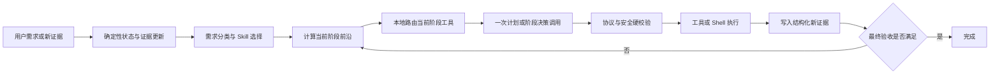

# Agent 模型调用与 Token 优化计划

> 计划日期：2026-09-03  
> 状态：首批修复已实施，后续阶段按质量门槛继续推进  
> 首批实施日期：2026-09-04  
> 范围：需求分类、计划生成、工具调用、阶段续接、整体复核、失败调整和模型上下文  
> 原则：减少无进展调用和重复上下文，但不削弱任务完成质量、安全门禁、真实证据、最终验收、多 Skill 协作或失败恢复。

## 0. 当前实施状态

本轮遵循用户要求，**没有新增、收紧或降低输入/输出 Token 数量限制**。现有 `limitOutput` 仍保持默认关闭；本轮节省来自减少重复调用、修复协议重试、裁剪不可调用工具和改善稳定前缀，而不是截断必要信息。

| 计划阶段 | 当前状态 | 本轮实际落地 |
|---|---|---|
| P1 协议热修 | 已完成 | `validation` 严格输出字符串并在模型 DTO 边界兼容布尔 `true`；完整合法工具步骤的空值也在本地确定性规范化，不再请求模型修复；非法类型、畸形工具和普通 Shell 仍严格拒绝；工具调用强制单行单工具单对象；standalone 混排改为拒绝，不再静默丢步。 |
| P2 停滞门禁 | 已加强 | 保留 `AdjustmentIncident` 同事件单次重拟；自动调整结果会与完整尝试历史比较，已完成命令或完全相同的失败 `command + validation` 不再进入执行队列。用户明确人工重试保留例外。本轮未增加调用数或 Token 预算，也未宣称完整 `progressKey` 已实施。 |
| P3 阶段工具路由 | 基础层已完成 | 11 个工具先按 `planner/context/internal` 降为最多 7 个模型可调用工具；内置 Skill 声明整个工作流的保守 `allowedToolIds`，通常进一步缩为 1～4 个；多 Skill 取允许并集、禁用并集；无 Skill 或旧版/自定义 Skill 缺少声明时回退完整 planner 目录，避免误隐藏业务能力；模型响应和执行边界都会拒绝未暴露工具。完整 capability、前置事实和阶段 DAG 路由仍待后续实施。 |
| P4 Skill 切片 | 未实施 | 本轮保留完整 active Skill 指令，优先保证领域规则与最终验收不丢失；尚未把全局规则、当前阶段和最终验收拆分。 |
| P5 决策与规划合并 | 已完成首版 | 阶段末由一次 `decide_ai_next_stage` 同时返回完成判断或最小下一阶段，`complete` 与 `steps` 强制互斥；异常时失败关闭并回退旧复核路径。有效后续计划带证据事件与策略指纹缓存，应用时不再第二次调用模型。 |
| P6 结构化 `toolCall` | 未实施 | 继续兼容现有 `opsark-tool` 字符串协议，但已补齐原子性门禁。 |
| P7 上下文与缓存 | 部分完成 | 工具/Skill 等相对稳定的策略字段移到动态快照之前；缓存同时受目标轮次、权限、模型、约束、Skill、工具说明和凭据元数据影响。`files.get_structure` 的远端 POSIX 路径已与 Windows 宿主语义解耦，避免工具失败引发上下文重发；scope 规范化去重仍待后续实施。 |

与原计划的一个有意差异是：首版联合决策没有使用会让每轮调用翻倍的线上 shadow 双调用，而是采用严格互斥协议、程序校验、旧路径失败关闭回退及自动化回归。后续如需比较不同模型的一致性，应使用离线日志回放或抽样诊断，不把双调用默认施加到业务任务。

## 1. 文档目的

本计划把开发者模型调用日志中暴露的 Token 浪费，整理成可分阶段实施、独立验证和随时回滚的工程方案。

优化目标不是让模型“少看必要信息”，而是做到：

1. 同一事实只以一个权威结构发送一次。
2. 能由程序确定的类型修复、重复判断、阶段推进和安全规则不再调用模型。
3. 每轮只发送当前证据允许执行的 Skill 阶段及该阶段可能使用的工具。
4. 只有产生新执行证据、用户输入或状态变化时，才允许再次复核或重规划。
5. 任何 Token 预算都只能暂停自动编排，不能跳过校验、把失败改成成功或降低安全要求。

相关基线文档：

- [Agent 上下文与 Token 优化记录](./TOKEN_CONTEXT_OPTIMIZATION_LOG.md)
- [Opsark 智能需求处理全流程说明](./INTELLIGENT_REQUIREMENT_PROCESSING_FLOW.md)
- [步骤校验优化](./STEP_VALIDATION_OPTIMIZATION.md)

## 2. 日志基线与问题定义

本次完整日志包含 54 次请求和 54 次响应，所有响应均为 HTTP 200，传输尝试次数为 1。问题是“模型调用次数过多 × 每轮重复发送较大的动态上下文”，不是网络重试、日志文件大小或输出过长。

| 指标 | 基线 |
|---|---:|
| 模型调用 | 54 次 |
| 输入 Token | 499,614 |
| 输出 Token | 14,506 |
| 总 Token | 514,120 |
| 输入占比 | 97.2% |
| 计划生成 | 34 次 / 402,742 Token |
| 结果复核 | 19 次 / 108,768 Token |
| 缓存 Token | 15,616，约占输入 3.1% |
| 单次输入平均值 | 9,252 Token |
| 单次输入 P90 | 13,618 Token |

已能明确归因的浪费如下：

| 来源 | 输入 Token | 占全部输入 |
|---|---:|---:|
| 计划协议修复调用 | 76,813 | 15.4% |
| 阶段结束后的整体复核 | 98,482 | 19.7% |
| 完全重复计划的后续调用 | 37,931 | 7.6% |
| 合计 | 213,226 | 42.7% |

此外，最大计划请求中的主要内容是 `baseSnapshot`、完整工具定义、完整 Skill 指令和固定系统提示；这四部分约占消息内容的 96%。因此，限制输出 Token 不能解决主要问题。

## 3. 不可退让的业务质量边界

所有优化必须保持以下不变量：

1. `rootGoal`、用户显式约束、授权级别和禁止操作不能因上下文压缩而丢失。
2. 成功只能由真实 `result/evidence` 和匹配作用域的验收证明，摘要、计划文本和模型判断不能替代证据。
3. 安全分析、风险审批、凭据隔离、真实退出码和独立后置校验保持程序级硬门禁。
4. 多 Skill 组合不能因减量而静默丢弃其中一个 Skill 的必要阶段或最终验收。
5. 通用编排器不得硬编码 Git、Node.js、数据库、部署或文件传输等领域流程。
6. Skill 不得控制全局安全、权限、重试预算或把失败事实改写为成功。
7. 工具路由不确定时可以暂停、回退到合法 Shell 发现或请求用户输入，但不得重新暴露全部工具后盲试。
8. 达到预算只进入人工接管状态，不自动标记业务失败，更不能标记完成。

## 4. 目标架构与职责边界

| 层级 | 负责 | 不负责 |
|---|---|---|
| 通用编排层 | 任务状态机、阶段前沿、证据账本、安全、授权、预算、停滞检测、调用去重 | 具体业务命令、领域阶段细节 |
| Skill 领域层 | 阶段依赖、进入条件、退出证据、允许的工具能力、领域禁令、最终验收 | API 重试、安全放行、真实执行 |
| 工具能力层 | 原子输入 Schema、执行模式、前置事实、产出事实、结构化结果 | 跨阶段工作流和成功结论 |
| 模型边界层 | 语义分类、基于当前证据规划、无法确定时解释阻断 | 确定性类型转换、重复检测、安全裁决 |

目标流程：



其中 C 阶段已经在 Rust 的 `requirement_classification_context()` 中移除了工具、敏感变量和凭据组；实施时应保留并增加回归测试。主要缺口是 Skill 选定后的规划、发现续接和调整计划仍会携带所有启用且未被 `forbiddenToolIds` 排除的完整工具定义。

## 5. 当前阶段如何确定“可能使用的工具”

### 5.1 判定原则

“可能使用”不能等同于关键词相似。一个工具只有同时满足以下条件，才进入当前模型请求：

```text
enabled
AND exposure == planner
AND 当前阶段允许该 capability
AND 未被任一 active Skill 禁止
AND 工具前置事实已经满足
AND 工具产出能够补齐当前阶段尚缺证据
AND 相同且仍有效的证据尚不存在
AND 用户授权和运行环境允许
```

路由输入必须来自结构化状态：

- `workflowPhase`：初始规划、发现后续接、失败调整、最终验收等。
- `activeSkillIds` 及各 Skill 当前尚未满足的阶段。
- `knownExecutionFacts`、最近步骤结构化结果和证据版本。
- 当前服务器、目标服务器、终端代次、凭据引用和用户输入状态。
- 用户执行约束、风险授权和失败分类。

路由器不得读取一大段 Skill 自然语言后自行猜阶段，也不得新增一次模型调用专门选择工具；否则只是用一次额外调用换取少量 Schema 节省。

### 5.2 阶段前沿

每个 Skill 将工作流表达为有证据条件的阶段图。通用编排器选择“进入条件已满足、退出证据尚未满足”的最前置阶段，称为当前阶段前沿。

多 Skill 同时激活时：

1. 合并各 Skill 的阶段依赖，形成带 Skill 命名空间的 DAG。
2. 优先选择能解除后续最多依赖的最小阶段。
3. 只有依赖相容且需要相同证据的阶段才可合并。
4. `forbiddenToolIds` 取并集，任何 Skill 的硬禁令都不能被覆盖。
5. 允许工具交集为空时返回明确冲突，不能静默忽略某个 Skill。

无 Skill 的通用任务使用 `generic.discover`、`generic.change`、`generic.verify`、`generic.recover` 四类通用阶段。Shell 仍是通用能力；只有结构化工具的前置事实和产出事实精确匹配当前证据缺口时，才发送该工具。

### 5.3 工具元数据扩展

在 `ToolDefinition` 中增加声明式路由信息：

```ts
type ToolExposure = "planner" | "context" | "internal";

interface ToolRoutingPolicy {
  exposure: ToolExposure;
  capabilities: string[];
  allowedWorkflowPhases?: string[];
  requiresFacts?: string[];
  producesFacts?: string[];
  conflictsWithCapabilities?: string[];
}
```

在 Skill 阶段中引用能力标签，而不是只硬编码内置工具 ID：

```ts
interface SkillStage {
  id: string;
  role: "discover" | "input" | "change" | "verify" | "recover";
  dependsOn?: string[];
  entryConditions: EvidenceRequirement[];
  exitEvidence: EvidenceRequirement[];
  allowedCapabilities: string[];
  preferredToolIds?: string[];
  forbiddenToolIds?: string[];
  instructions: string;
}
```

能力标签保证自定义工具可以接入通用路由；`preferredToolIds` 和 `forbiddenToolIds` 则保留 Skill 对凭据、传输和终端跳转等高风险业务的精确约束。

### 5.4 当前 11 个工具的建议暴露策略

| 工具 | 暴露 | 仅在以下当前阶段发送 |
|---|---|---|
| `server.basic_info` | `context` | 基础信息由程序采集进服务器快照，不作为模型可调用工具；未来若增加真实外部执行实现再调整 |
| `server.realtime_metrics` | `context` | 实时指标由程序采集进上下文，不作为模型可调用工具 |
| `server.resolve_connection` | `planner` | 目标 host/port 已知、网络已可达、连接资料未知，且当前 Skill 允许 SSH 资料查询 |
| `server.connect` | `planner` | 终端 SSH 跳转阶段、唯一凭据引用已确定；文件传输 Skill 禁止使用 |
| `secret.metadata` | `internal` | 当前执行器没有外部调用分支；在真正成为原子可调用能力前不发送给模型 |
| `secret.merge_command` | `internal` | 只在执行边界合并占位符，永不由规划模型直接调用 |
| `user.request_input` | `planner` | 任务必需信息无法从已有上下文或只读证据获得；该轮只能生成此 standalone 步骤 |
| `files.get_structure` | `planner` | 已知绝对根目录、目录结构证据缺失或失效，并且当前阶段需要项目/文件发现 |
| `files.read_content` | `planner` | 已由真实目录证据确认精确文本文件路径，且其内容是当前决策所需证据 |
| `software.check` | `planner` | 软件名称已由用户或项目证据明确，当前缺少路径或版本兼容证据 |
| `files.transfer_between_servers` | `planner` | 文件传输阶段，源文件与目标已确认、目标有 managed-server 引用、覆盖策略和授权明确 |

当前 `executeToolCall()` 只实现了 7 个外部可调用分支，其余工具会返回 `TOOL_NOT_EXTERNALLY_CALLABLE`。新增 `exposure` 后，`buildToolContext()` 必须默认排除 `context/internal`，防止把不可执行能力交给模型。

### 5.5 典型阶段示例

SSH 跳转：

| 已知状态 | 本轮完整工具 Schema |
|---|---|
| 端口连通性未知 | 无；先生成有界只读 Shell 检查 |
| 网络可达、连接资料未知 | 仅 `server.resolve_connection` |
| 明确无可用凭据 | 仅 `user.request_input` |
| 唯一凭据引用已确定 | 仅 `server.connect` |
| 已完成跳转 | 无；使用 Shell 验证当前主机和身份 |

项目发现与部署：

| 已知状态 | 本轮完整工具 Schema |
|---|---|
| 项目根目录已知、结构未知 | 仅 `files.get_structure` |
| 目录树已知、关键文件路径已确认 | 仅 `files.read_content` |
| 技术栈已由文件内容证明、工具链状态未知 | 仅 `software.check` |
| 缺少业务专属敏感配置 | 仅 `user.request_input` |
| 依赖安装、构建、启动或最终验收 | 通常无工具 Schema，使用受控 Shell 与独立校验 |

文件传输：

| 已知状态 | 本轮完整工具 Schema |
|---|---|
| 源文件、网络或 BatchMode 认证尚未检查 | 无；使用只读 Shell 取得证据 |
| 认证失败且目标连接资料未知 | 仅 `server.resolve_connection` |
| 确定缺少用户凭据 | 仅 `user.request_input` |
| 已取得 managed-server 引用且满足传输条件 | 仅 `files.transfer_between_servers` |

### 5.6 路由失败与回退

- 候选为 0：允许当前阶段用 Shell 完成发现、变更或验证；如果阶段声明必须有工具，则报告 `required_capability_unavailable`。
- 候选为 1：只发送该工具完整定义。
- 候选大于 1：按“解除阻断依赖数、证据新鲜度、Skill preferred、最小副作用”排序，只发送同一阶段真实可选的少量工具。
- 命中 `planMode=standalone`：该轮完整工具集合和生成计划都收敛为该单一工具；执行结果写入证据后重新计算阶段。
- 路由器异常：fail closed 并记录路由诊断，不回退为全部 11 个工具。

## 6. Skill 指令按当前阶段切片

### 6.1 目标结构

当前模型侧的 `SkillDefinition` 主要是整段 `instructions` 加全局 `forbiddenToolIds`。调整计划会再按字符截断，这既重复发送非当前阶段规则，也可能截掉最终验收要求。

建议将 Skill 拆为：

```ts
interface SkillDefinition {
  globalInstructions: string;
  stages: SkillStage[];
  finalAcceptance: EvidenceRequirement[];
  forbiddenToolIds?: string[];
}
```

不同调用只发送：

| 调用 | Skill 内容 |
|---|---|
| 需求分类 | 名称、描述、selection hints，不发送完整阶段 |
| 当前阶段规划 | 精简全局硬约束、当前阶段、直接依赖阶段的已满足证据 |
| 失败调整 | 当前失败阶段、真实错误、允许的恢复分支 |
| 整体完成判断 | `finalAcceptance` 和已验证证据，不发送全部执行方法 |

### 6.2 通用性与针对性的平衡

- 通用核心提供统一阶段角色、证据表达式、安全和预算语义。
- Skill 只声明领域依赖、阶段说明、能力许可和验收要求。
- Tool 通过 capability 接入，新增自定义工具不要求修改通用状态机。
- 自定义 Skill 必须在保存时校验阶段 ID、DAG 无环、能力标签、工具引用和退出证据。
- 旧版仅有 `instructions` 的 Skill 使用 legacy adapter，继续按原方式运行；先双轨读取，再逐个迁移内置 Skill。
- 多 Skill 冲突优先级固定为：

```text
用户显式约束
> 通用安全与权限门禁
> 各 Skill forbiddenToolIds 并集
> 必需退出证据
> preferredToolIds
```

## 7. 计划协议修复

### 7.1 立即兼容热修

当前 Rust `AiPlanStep.validation` 是字符串，但提示词要求把工具步骤的 validation “精确设为 true”，模型会合理地产生 JSON 布尔值，从而触发携带完整上下文的昂贵重试。

第一阶段采用“严格输出、窄容错输入”：

1. 所有协议、修复提示和 Skill 示例统一写为 `"validation":"true"`。
2. 只在模型响应 DTO 的反序列化边界兼容布尔 `true`，立即规范化为字符串 `"true"`。
3. 拒绝布尔 `false`、`null`、数字、对象和数组。
4. 普通 Shell 步骤继续由语义校验拒绝无条件 `true`。
5. 内部 `PlanStep` 和前端类型保持严格字符串，避免把兼容类型扩散到业务层。

### 7.2 结构化工具调用迁移

中期协议改为判别联合：

```json
{
  "kind": "tool",
  "toolCall": {
    "toolId": "files.get_structure",
    "arguments": {"rootPath": "/opt/app"}
  }
}
```

Shell 步骤保留 `command` 和 `validation`。迁移顺序：

1. 后端双读：同时接受结构化 `toolCall` 与旧 `opsark-tool <id> <JSON>`。
2. 内部统一：两种输入都规范化为同一工具调用对象。
3. 前端原生执行 `PlanStep.toolCall`，旧持久化任务继续兼容字符串解析。
4. 稳定版本后停止让模型输出旧字符串协议，但保留持久化迁移读取。

无论供应商是否支持严格 JSON Schema，本地字段、Schema、安全和 Skill 工具策略校验都不能取消。

### 7.3 standalone 原子性

- 一个工具步骤只能包含一个工具调用和一个 JSON 对象参数。
- standalone 工具与其他待执行步骤共存时拒绝该计划，不静默删除其他步骤。
- 多个安全只读发现工具如需连续执行，由阶段状态机根据前一个真实结果继续，不允许模型在一个 command 中拼接多个调用。
- 能由程序安全拆分且不存在数据依赖时可本地拆分；无法证明独立时必须拒绝并给出窄范围错误。

## 8. 调用次数与停滞门禁

### 8.1 调用前进展指纹

每次调用模型前计算：

```text
progressKey =
  rootGoalRevision
  + evidenceFingerprint
  + activeStageIds
  + currentPlanFingerprint
  + credentialRevision
  + terminalGeneration
```

以下变化才算真实进展：

- 新的命令或工具结构化结果。
- 新的、作用域匹配的验证证据。
- 用户提交了新信息或明确改变约束。
- 凭据引用、终端连接代次或目标环境真实变化。
- 当前阶段退出条件由未满足变为满足。

计划措辞、summary、时间戳、相同命令的重新编号和同一错误的再次包装不算进展。

### 8.2 调用前门禁顺序

1. `progressKey` 与上次相同：不调用模型，复用确定性结论或进入人工接管。
2. 候选计划指纹与历史相同且没有新证据：拒绝重新执行和重新规划。
3. 确定性协议错误：本地规范化或返回字段级错误，不发送完整上下文。
4. 同一阶段连续无进展超过阈值：暂停自动编排。
5. 达到软预算：缩窄为当前阶段和当前错误，并预留最终验收额度。
6. 达到硬预算：进入 `manual_required/budget_exhausted`，展示已验证事实、阻断原因和安全下一步。

预算至少分别统计：

- `modelCalls`
- `inputTokens`
- `protocolRepairs`
- `reviewReplans`
- `stageVisits`
- `consecutiveNoProgress`

预算应按任务复杂度配置，不能用一个过小常量限制所有长任务。协议修复和无进展重试使用严格小上限；有新证据的正常阶段允许继续，但仍受任务总软预算观察。

## 9. 合并整体复核与下一阶段规划

当前阶段结束后，会先发送 `baseSnapshot` 判断整体目标是否完成；未完成时又把同一快照发送给调整计划。共享前端对象只减少了本地重复计算，没有减少 API 输入。

普通阶段结束路径改为一次 `decideNextStage` 调用：

```json
{
  "decision": "complete|continue|adjust|blocked",
  "reason": "简短说明",
  "summary": "当前阶段事实摘要",
  "nextStage": "skill-id/stage-id",
  "steps": []
}
```

约束：

- `complete`：`steps=[]`，并且程序级最终验收已具备充分证据。
- `continue`：继续已有待执行步骤，不生成替代计划。
- `adjust`：只返回当前阶段允许的最少修复步骤。
- `blocked`：列出缺失证据、权限或用户输入，不生成猜测命令。
- 模型不能覆盖退出码、安全拒绝、审批和证据作用域。
- 长任务 30 秒周期复核保持独立；它判断是否继续等待当前进程，不承担业务重规划。
- 安全门禁字段修复继续使用不带通用快照的窄请求。

先以 shadow mode 同时计算旧决策和新决策但只执行旧路径，比较完成、继续、阻断和计划差异；达到一致性门槛后再切换执行权。

## 10. 上下文减量与缓存布局

### 10.1 动态快照

- 保留现有“最近两个详细阶段 + 更旧历史滚动检查点”结构。
- 将 `scope` 只保存在一个规范位置，消费者通过引用读取，避免顶层和 evidence 重复。
- 成功事实只保留结构化结果、证据指纹和必要摘要；异常事实保留有界原始证据。
- 同一 `baseSnapshot` 在一次阶段决策中只发送一次。
- 快照裁剪必须按证据相关性和阶段依赖进行，不能仅按字符数从尾部截断。

### 10.2 稳定前缀

请求字段顺序固定为：

1. 通用系统协议和 JSON Schema。
2. 当前版本的通用安全规则。
3. 当前阶段 Tool Schema。
4. 当前阶段 Skill 规则。
5. 动态任务快照、最新证据和用户输入。

稳定内容必须采用确定顺序、稳定序列化和版本指纹，避免无意义的字段顺序、时间戳或描述变化破坏供应商前缀缓存。缓存命中是优化指标，但不得依赖缓存才能满足成本门槛。

### 10.3 不允许的减量方式

- 不删除失败原始错误的关键行。
- 不删除当前阶段所依赖的已验证事实。
- 不用模型自然语言摘要替代结构化证据。
- 不因上下文过大省略用户禁止操作、安全审批或最终验收。
- 不通过降低模型输出质量、减少必要验证或默认猜测来换取 Token。

## 11. 实施阶段

| 阶段 | 主要内容 | 风险 | 完成门槛 |
|---|---|---|---|
| P0 观测基线 | 增加按任务/阶段/上下文部分的调用、Token、缓存、指纹和路由日志 | 低 | 能重放本次日志并得到同一基线 |
| P1 协议热修 | `validation` 窄兼容、明确字符串协议、standalone 拒绝静默丢步 | 低 | 历史协议样本不再触发完整重试，安全测试全通过 |
| P2 停滞门禁 | `progressKey`、重复计划拦截、分项软硬预算 | 中 | 相同快照/证据不产生重复模型调用 |
| P3 阶段工具路由 | `exposure/capabilities`、Skill 阶段前沿、仅发送候选工具 | 中 | 通用、单 Skill、多 Skill 路由回放无必要工具缺失 |
| P4 Skill 切片 | 全局规则、当前阶段、最终验收分离；legacy adapter | 中高 | 内置 Skill 逐个迁移且业务回归不下降 |
| P5 决策与规划合并 | `decideNextStage`、互斥响应、shadow mode | 高 | 决策一致性达标且无假完成、安全回归 |
| P6 结构化 `toolCall` | 后端双读、前端原生执行、旧任务迁移 | 中高 | 新旧协议回放一致，旧持久化任务可继续 |
| P7 上下文与缓存 | 去重 scope、按依赖裁剪、稳定前缀 | 中 | 证据完整性不下降，Token 目标达成 |

建议每个阶段独立提交、独立 feature flag、独立指标看板。不得把 P3～P7 合成一次不可回滚的大改。

## 12. 测试矩阵

### 12.1 协议与安全单元测试

- 工具步骤的字符串 `"true"`、布尔 `true` 规范化及非法类型拒绝。
- 普通 Shell 步骤不能用 `true` 绕过 validation。
- 单工具、双工具拼接、非法 JSON、未知工具和 Schema 不匹配。
- standalone 与其他步骤混排必须拒绝，且不得静默丢失步骤。
- `forbiddenToolIds` 在规划和执行边界都 fail closed。

### 12.2 工具路由测试

- 11 个工具分别覆盖命中、不命中、前置事实缺失、证据已存在和禁用场景。
- `context/internal` 工具永不进入模型工具列表。
- SSH、源码获取、软件安装、构建、数据库、部署和文件传输逐阶段 golden cases。
- 无 Skill 通用查询、通用变更和通用验证仍能生成有效 Shell 计划。
- 多 Skill DAG、工具禁令冲突、相容阶段合并和能力不可用阻断。
- 自定义 Skill、自定义工具和 legacy Skill 的兼容回归。

### 12.3 调用编排测试

- 相同 `progressKey` 不调用模型。
- 新执行证据产生后允许进入下一阶段。
- 完全相同计划指纹不能再次执行。
- 达到预算进入人工接管但不标记成功或业务失败。
- `complete` 必须通过程序最终验收；证据不足时强制降级为 blocked/adjust。
- 周期性长任务复核不触发业务阶段重规划。

### 12.4 历史日志回放

使用脱敏 fixture 回放本次典型响应：

- `validation: true`。
- 一个 command 拼接两个工具。
- `software.check` 参数错误。
- 后台进程脱离执行器跟踪。
- 三次相同“读取项目依赖声明”计划。
- 两次相同“诊断目录结构”计划。
- standalone 前存在依赖步骤。

回放比较旧版与新版的调用数、输入 Token、最终计划、工具选择、证据链、安全结果和最终完成判断。

## 13. 量化验收门槛

### 13.1 成本与停滞

- 同一请求指纹不得连续发送两次。
- 本次日志中的 7 次协议修复型调用降为 0；只有真正语义不完整的计划允许至多 1 次字段级窄修复。
- 完全重复计划的后续模型调用降为 0。
- 同一阶段、同一证据版本不得重复整体复核和重规划。
- 在相同历史回放上，输入 Token 至少降低 35%；目标降低 45%～55%。
- 在相同历史回放上，模型调用数至少降低 30%；目标降低 40% 以上。
- P90 单次输入 Token 相对 13,618 的基线至少降低 30%。

### 13.2 业务质量

- 通用任务、单 Skill 和多 Skill 的任务完成率不得低于基线。
- 必需阶段遗漏、必要工具被隐藏、已验证事实丢失和假完成均为 0 个阻断级回归。
- 高风险审批绕过、敏感值进入模型、非零退出被改写为成功均为 0。
- 计划首次协议通过率提升，但不得通过放宽安全规则实现。
- 最终验收覆盖率、证据作用域匹配率和失败分类准确率不得下降。
- 人工接管增加必须能归因于真实预算或能力阻断，不能来自路由器误隐藏工具。

只有成本门槛和业务质量门槛同时满足，阶段才允许默认启用。

## 14. 观测字段

开发者日志新增或统一以下脱敏字段：

```text
taskId
roundId
workflowPhase
activeStageIds
selectedSkillIds
candidateToolIds
excludedToolReasons
snapshotFingerprint
evidenceFingerprint
planFingerprint
progressKey
attemptReason
modelCallsByReason
promptTokens
completionTokens
cachedTokens
contextChars.system
contextChars.snapshot
contextChars.tools
contextChars.skills
contextChars.evidence
```

不得记录真实密码、令牌、私钥、完整凭据、未脱敏终端正文或敏感变量值。

## 15. 代码落点

| 目标 | 主要文件 |
|---|---|
| 工具暴露与路由元数据 | [`src/features/tools/types.ts`](../src/features/tools/types.ts)、[`toolCatalog.ts`](../src/features/tools/toolCatalog.ts)、[`toolContext.ts`](../src/features/tools/toolContext.ts) |
| Skill 阶段结构与兼容 | [`src/features/skills/types.ts`](../src/features/skills/types.ts)、[`instructionBuilder.ts`](../src/features/skills/instructionBuilder.ts)、各内置 Skill |
| 阶段前沿和上下文切片 | [`agentContext.ts`](../src/features/agent/agentContext.ts)、[`taskProgression.ts`](../src/features/agent/taskProgression.ts) |
| 快照、证据和指纹 | [`taskDecisionSnapshot.ts`](../src/features/agent/taskDecisionSnapshot.ts)、[`taskHistoryCheckpoint.ts`](../src/features/agent/taskHistoryCheckpoint.ts) |
| 复核与下一阶段合并 | [`agentService.ts`](../src/features/agent/agentService.ts)、[`ops.ts`](../src/stores/ops.ts)、[`backend.ts`](../src/services/backend.ts) |
| 模型协议和有限修复 | [`src-tauri/src/lib.rs`](../src-tauri/src/lib.rs)、[`src-tauri/src/tests.rs`](../src-tauri/src/tests.rs) |
| 工具协议和 standalone | [`toolExecutor.ts`](../src/features/tools/toolExecutor.ts)、[`planNormalizer.ts`](../src/features/agent/planNormalizer.ts)、[`executionDispatch.ts`](../src/features/agent/executionDispatch.ts) |

## 16. 发布与回滚

1. 每一阶段以独立 feature flag 灰度，先记录 shadow 指标，再取得执行权。
2. 新旧计划协议在迁移期双读；持久化数据升级必须可逆或保留旧字段。
3. 工具路由日志必须说明每个工具为何进入或被排除，便于发现误隐藏。
4. 任一阶段出现假完成、安全差异、必需阶段遗漏或任务完成率下降，立即关闭该阶段 flag。
5. 回滚只恢复旧编排路径，不删除新版本产生的结构化证据和审计记录。
6. 布尔 `true` 兼容层记录命中率；当所有受支持模型稳定输出新协议后，再单独评估移除，不能无期限掩盖协议错误。

## 17. 明确不采用的方案

- 只降低 `maxOutputTokens`：输入占 97.2%，收益极小且可能截断必要计划。
- 粗暴删除历史：会降低故障恢复、重复识别和最终验收质量。
- 每轮增加一次“工具选择模型调用”：会增加调用次数和新失败点。
- 仅靠关键词选择工具：无法可靠处理多阶段依赖、已有证据和 Skill 禁令。
- 所有 Skill 共用固定工具白名单：会破坏扩展性和多 Skill 组合。
- 达到 Token 上限后自动宣布完成：违反真实证据和失败关闭原则。
- 一次性替换所有计划、工具和持久化协议：回归面过大且难以回滚。

## 18. 推荐实施顺序

1. 先补齐观测和历史日志回放 fixture，冻结质量基线。
2. 修复 `validation` 类型矛盾与 standalone 静默丢步，立即消除协议型浪费。
3. 增加 `progressKey`、重复计划门禁和任务级软硬预算。
4. 增加 `ToolExposure`，先移除不可外部调用工具，再上线当前阶段工具路由。
5. 将内置 Skill 逐个迁移为结构化阶段，保留 legacy adapter。
6. 以 shadow mode 验证并切换 `decideNextStage`，合并整体复核和重规划。
7. 迁移结构化 `toolCall`，最后完成上下文规范去重与缓存前缀稳定化。

这个顺序优先处理低风险、收益明确的问题，并把高风险的复核合并和 Skill 数据结构迁移放在充分回放验证之后。
