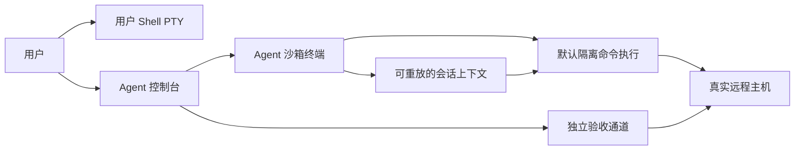

# Agent 沙箱终端与执行链路整体优化计划

> 制定日期：2026-08-29
> 当前状态：代码实施、自动化验收、真实 SSH/PTY/SFTP、双会话隔离、Shell 启动事务、Opsark UI 主路径及 v0.2.0 版本点已完成；Git 私库凭据、真实断线恢复和发布观察期仍在进行
> 适用范围：Opsark Core 远程 Shell、Agent 执行、验收证据、任务编排、Skill 路由和完全托管恢复链路

## 0. 实施进度

| 日期 | 阶段 | 状态 | 已完成 | 验证 |
|---|---|---|---|---|
| 2026-08-29 | 基线 | 已完成 | 确认生产时序为 `ops.ts -> terminalSessionStore -> TerminalPanel -> 用户 PTY`；确认后端已有独立 SSH exec 备用通道 | 终端相关 4 个测试文件、35 项用例通过 |
| 2026-08-29 | 阶段 0 | 已完成 | 建立 ADR-001 和 `agentSandboxTerminalV1` 开关；默认使用沙箱通道，回滚仅能切到独立无状态 SSH exec，不允许切回用户 PTY；已勘误两份历史文档 | 阶段 0 相关 4 个测试文件、35 项用例通过；`vue-tsc --noEmit` 通过；`git diff --check` 通过 |
| 2026-08-29 | 阶段 1–2 | 已完成 | 增加作用域、AgentSession、证据和 Rust `AgentTerminalManager`；实现可选计划作用域/上下文协议、真实退出码、流式输出、进程组中断和凭据提示通道 | Rust 库测试现为 76 项通过、2 项真实环境测试按设计忽略 |
| 2026-08-29 | 阶段 3–4 | 主路径完成 | 新增独立 Agent 终端 UI/状态库；主命令、validation、取消、长任务、`server.connect` 和凭据解锁已路由到显式 execution target | 前端全量测试、生产构建、真实 SSH 底层链路和 Opsark UI 默认沙箱主路径通过；真实 transport 故障注入仍在观察 |
| 2026-08-29 | 阶段 5–6 | 已完成 | 实现结构化 Shell 上下文、fresh shell 作用域、执行器快照/自动回滚事务、scope evidence 和当前轮次总结 | Shell/scope/ledger 单元测试和 TypeScript 检查通过 |
| 2026-08-29 | 阶段 7–8 | 已完成 | Skill 允许零匹配；风险改为结构化变更语义；收口单一托管调度器；长任务加入 CPU/IO/子进程进展采样 | 托管竞态、风险、长任务回归通过 |
| 2026-08-29 | 阶段 9 | 已完成 | 生产代码移除 READY/BEGIN/END、Agent 命令槽、用户键盘锁和 pane target 推断；用户 `TerminalPanel` 恢复为纯用户 Shell | 生产源码全局搜索无 Agent 注入调用；迁移测试通过 |
| 2026-08-29 | 阶段 10 | 进行中 | 流程、终端历史、模块说明和重构索引已同步；旧 terminal binding 只读迁移；默认启用新路径并保留独立 exec 回退 | Vitest 75 个文件、484 项通过；Rust 76 项通过；Clippy、格式和 Vite 生产构建通过；Opsark UI 主路径通过，发布观察期已启动 |
| 2026-08-30 | 首次真实 SSH 探测 | 阻断已解除 | 用户已明确授权测试服务器 `192.168.1.237`；首次对 SSH `22`、历史上下文中的 `40122` 和 Web Console `9090` 发起 8 秒有界连接探测时均在 TCP 建连阶段超时，未进入认证且未产生远端变更 | 该临时网络阻断随后解除；保留记录用于区分网络失败与认证失败，不再是当前阻塞项 |
| 2026-08-30 | 最终本地回归 | 已完成 | 在真实环境探测和优先级测试补齐后重新执行前端全量测试、Rust 库测试、生产构建、Clippy、Rust 格式和 diff 格式检查 | Vitest 75 个文件、484 项通过、16 项历史共用 PTY 基线按设计跳过；Rust 76 项通过、2 项外部依赖测试默认忽略，其中 SSH live test 已单独显式运行通过；其余检查均以退出码 0 完成 |
| 2026-08-30 | 真实环境恢复验收 | 部分完成 | 网络恢复后成功连接 `192.168.1.237:22`；真实 Rust SSH 集成测试覆盖主机探测、独立 exec、PTY 与 SFTP 创建/读写/改名/删除；两条 SSH 会话并行运行且关闭用户会话不影响另一会话中的 24 秒长任务 | `probe_live_ssh_adapter` 真实测试 1 项通过；用户会话和 Agent 会话的 cwd/environment 隔离；长任务输出完整到达结束标记 |
| 2026-08-30 | Shell 启动事务与回归补齐 | 已完成 | 新增 `.bash_profile` 抢占 `.profile` 的 fresh login shell 回归；真实服务器上对既有 `/root/.bashrc`、`/root/.profile` 错误 `[-s` 做快照、原子最小修复和全新 SSH 登录验收 | 新回归通过；全新登录无报错，NVM `0.40.7`、Node `v22.23.2`、npm `10.9.8` 自动可用；原会话仍保持未加载状态；两个备份文件保留在服务器 |
| 2026-08-30 | Opsark UI 主路径 | 已完成 | 在真实 Tauri 开发构建中连接 `192.168.1.237`；默认开关创建可见 Agent 沙箱终端；两个独立目标分别形成独立任务和 Agent 标签；完全托管自动批准只读计划；关闭服务器工作台标签后 30 秒 Agent 任务继续完成 | 主机名/Git 只读任务退出码 0；长任务连续输出 6 个时间点并以 `OPSARK_UI_LONG_DONE` 收口；重新进入工作台后输出、结果和隔离作用域均完整可见，未出现“生成调整方案”按钮 |
| 2026-08-30 | v0.2.0 发布候选 | 观察中 | 应用版本提升到 `0.2.0`；基线提交 `da2271d` 已建立 `opsark-pre-agent-sandbox-v0.1.0` 回滚标签；新版本提交后建立 `opsark-v0.2.0-agent-sandbox` 标签；功能开关关闭仍回退到独立无状态 SSH exec | 原生 release 构建和 `Opsark.app` 打包通过；观察期从 v0.2.0 提交与标签创建后开始；不得在单次验收会话中伪造“一个完整版本观察期已结束” |
| 2026-08-30 | UI transport 故障注入 | 本机授权阻塞 | 已建立独立控制 SSH，会话侧确认不存在既有 `sshd: root@notty`，准备仅终止测试任务新建的非 PTY 连接；未重启 SSH 服务、未终止用户 PTY、未产生远端变更 | v0.2.0 重编译后 macOS 要求重新授权开发版读取登录钥匙串中的 `com.opsark.desktop` 凭据；缺少 macOS 登录钥匙串授权时不得猜测密码或绕过系统 ACL，因此未启动故障命令，场景 6、7保持待验收 |

进度记录约定：只有代码、测试和文档三者中适用的验收条件都已满足，才将清单标记为完成；已有实现也必须经过本次回归确认。

当前 Vitest 中的 16 项 `skip` 是阶段 0 保留的旧共用 PTY 行为基线，它们引用的生产 API 已删除，不属于新架构未通过用例。Rust 的 2 项 `ignored` 分别需要显式提供真实模型 Key 和 SSH 凭据。

用户已在 2026-08-30 明确授权 `192.168.1.237` 作为测试服务器，并通过会话提供 SSH 凭据；凭据未写入命令、URL、脚本或本文档。首次探测曾因执行环境网络暂不可达而超时，网络恢复后已经完成 SSH/PTY/SFTP、双会话隔离、关闭用户会话后的长任务存活、Shell 启动事务以及真实 Opsark UI 主路径验收。尚未完成的是需要独立 Gitee 凭据的私库重新克隆、需要 macOS 重新授权开发版读取 Opsark 钥匙串凭据后才能进行的真实传输断线/恢复注入、完全托管三轮异常续接的 UI 观察，以及一个完整版本的发布观察期。

测试服务器的 `/opt/ground_check` 已确认是完整 Git 工作树，origin 为 `https://gitee.com/songpenley/ground_check.git`，HEAD 为 `e3117df98bbde8a85f2faaf700fd3713379cc8ad`；这只证明现有仓库状态，不替代私有仓库凭据注入和原子克隆验收。服务器 SSH 密码不能作为 Gitee 凭据使用。

## 1. 文档目的

本计划将 Opsark 从“Agent 与用户共用交互式 PTY”迁移到“用户 Shell 与 Agent 沙箱终端完全分离”的执行架构，并同步修复近期暴露的以下系统性问题：

- Agent 子 Shell 成功被错误总结为用户当前 Shell 已生效。
- `source`、`export`、`cd`、NVM/Conda/pyenv 等会话状态缺少可执行的作用域模型。
- Shell 启动文件写入成功，但新 Shell 无法真实加载。
- validation 通过重复 `source` 绕过被验证目标，形成自证式假阳性。
- Skill 误选后阻断通用执行，没有安全降级为零 Skill。
- 多轮需求的 `rootGoal`、当前指令和历史证据混入当前总结。
- 完全托管连续调整存在倒计时锁竞态，意外回退为人工“生成调整方案”。
- 风险识别依赖命令关键词，无法稳定识别包卸载、配置覆盖和服务删除等语义。
- 长任务的输出沉默被简化为无进展，容易误停下载、安装或构建。
- 终端重构文档与当前实现存在明显偏差。

本计划不针对 NVM 写一组业务硬编码；目标是建立可适用于任意 Shell、任意 Skill 和任意远程执行场景的通用边界。

## 2. 当前基线与根因

### 2.1 当前真实执行方式

当存在可见 SSH 工作台时，`ops.ts` 将 Agent 命令发往任务绑定的用户 PTY；`TerminalPanel.vue` 再把命令包装到子 Shell 中执行。这同时造成两种相反的错觉：

1. UI 上 Agent 和用户看似在同一个 Shell。
2. 实际上 Agent 的环境修改又因子 Shell 退出而丢失。

因此，当前系统既没有稳定的共用 Shell 语义，也没有清晰的隔离 Shell 语义。

### 2.2 文档与代码偏差

`SHELL_WORKSPACE_REBUILD_PLAN.md` 的 0.17 曾记录独立 Agent 终端，0.18 又删除该组件；0.18 文本声称 Agent 仍使用独立 SSH 命令通道，但当前代码实际重新走绑定 PTY。

实施前必须以当前代码和自动测试为基线，不能直接把任一历史文档当成真实实现。

### 2.3 迁移前真实时序（已固化）

1. `ops.ts` 在步骤进入执行时调用 `resolveTaskPaneId()` / `bindAgentTask()` 选中用户 Shell pane。
2. `runCommandLifecycle()` 的自定义 executor 等待该 pane 连接，再调用 `requestAgentPtyCommand()`。
3. `terminalSessionStore` 在 pane 上建立命令槽、中断等待器和临时凭据回调。
4. `TerminalPanel` 向用户 SSH PTY 先发 READY 探针，再发 BEGIN/END 包装命令，并从同一输出流拆出 Agent 结果。
5. 命令实际在包装子 Shell 中运行；`cd` / `export` / `source` 等临时状态在包装结束后丢失，但 UI 又容易让用户认为它修改了当前 Shell。

阶段 0 的黑盒基线测试覆盖了 READY/BEGIN/END、实时输出、退出码、中断恢复、Git HTTPS 用户名/密码提示和凭据清理。这些测试只用于记录旧行为；新路由的回归条件是生产代码不再触发这些用户 PTY 协议。

### 2.4 架构决策 ADR-001

- 决策：用户 Shell 永不接受 Agent 注入；Agent 每任务使用独立 AgentSession。
- 主路径：`agentSandboxTerminalV1=1` 使用 AgentTerminalManager 和独立可见输出。
- 一版本回滚：`agentSandboxTerminalV1=0` 使用已有独立无状态 SSH exec。这会丢失 AgentSessionContext 持续语义，但仍不允许向用户 PTY 注入。
- 不接受的回滚：恢复 `ops.ts -> terminalSessionStore -> TerminalPanel` 命令注入。

## 3. 目标架构决策

### 3.1 双终端、双执行平面



#### 用户 Shell

- 只接受用户键盘输入。
- Agent 不再注入命令、切换只读视图或锁定键盘。
- Agent 不得宣称已修改用户当前 Shell 的内存状态。
- 修改用户已打开 Shell 必须转换为明确的 `user_action`。

#### Agent 沙箱终端

- 每个执行任务拥有独立 `AgentSession`、SSH 通道、执行队列和 generation。
- 默认只读展示，用户可搜索、复制、中断命令或结束任务，不能向 Agent 协议流插入键盘输入。
- 展示需求理解、步骤标题、脱敏命令、实时输出、真实退出码、验收作用域和复核事件。
- “沙箱”仅表示会话隔离；远程主机文件、软件包和服务变更仍然真实生效。UI 必须始终显示这一点。

### 3.2 不盲目依赖原始持久 Shell 内存

任意 Shell 命令都可能通过 `exit`、`exec`、`set -e`、`trap`、`stty` 或异常终止破坏持久交互 Shell。因此第一版不应把所有命令直接运行在一个永不退出的 Bash 父环境中。

目标采用“独立 Agent 终端展示 + 默认命令隔离 + 可重放会话上下文”：

- 普通命令仍在可跟踪子进程中运行。
- 工作目录、非敏感环境变量和需要 source 的文件由 `AgentSessionContext` 结构化保存。
- 执行器在每条需要的命令前重放这些上下文，而不依赖上一个子 Shell 偶然留下内存状态。
- 敏感值不得进入可持久环境变量；仍由现有凭据注入边界提供。
- 任务恢复、PTY 重建或 generation 变化后，上下文可以重放，但未结构化记录的临时 Shell 状态必须视为已丢失。

### 3.3 执行作用域

```ts
export type ExecutionScope =
  | "agent_session"
  | "isolated_exec"
  | "fresh_interactive_shell"
  | "fresh_login_shell"
  | "managed_service"
  | "user_action";

export interface AgentSessionContext {
  cwd?: string;
  environment: Record<string, string>;
  sourceFiles: string[];
  shell: "bash" | "sh" | "zsh";
  revision: number;
}
```

| Scope | 定义 | 典型用途 |
|---|---|---|
| `agent_session` | 在 Agent 沙箱中执行，重放当前 AgentSessionContext | 项目目录、NVM/Conda 执行上下文 |
| `isolated_exec` | 独立 SSH exec，不继承 Agent 会话状态 | 文件、服务、端口和进程验收 |
| `fresh_interactive_shell` | 新的交互 Shell | `.bashrc` 行为验收 |
| `fresh_login_shell` | 新的登录 Shell | `.profile/.bash_profile` 行为验收 |
| `managed_service` | 受系统管理器托管的持久进程 | systemd、容器、守护进程 |
| `user_action` | 系统不代替用户执行 | 修改用户已打开的 Shell |

## 4. 必须维持的架构不变式

1. Agent 不得向用户 Shell PTY 注入任何命令、标记、凭据或控制字符。
2. 用户 Shell 的关闭、重连、前台进程和输入草稿不得影响 AgentSession。
3. AgentSession 故障不得关闭或重建用户 Shell。
4. 主命令、validation 和状态稳定复核必须拥有独立 `executionId`、真实退出码和证据作用域。
5. 执行证据必须记录发生在哪个 target、session、generation、scope 和 cwd。
6. 任务总结只能宣称当前作用域证明的结果。
7. 高风险或确定性破坏操作继续人工确认；独立 Agent 终端不会降低主机变更风险。
8. 关闭 UI 展示不等于取消任务；取消必须走统一中断协议。
9. 应用重启后不得伪造 Agent PTY 或远程前台进程仍然存活。
10. 用户开启的新任务默认拥有新 AgentSession；新目标不得复用旧任务不可见的 Shell 内存。

## 5. 目标数据模型

### 5.1 任务与 AgentSession

```ts
export interface AgentSessionRef {
  id: string;
  serverId: string;
  taskId: string;
  generation: number;
  state: "creating" | "ready" | "busy" | "recovering" | "closed";
  context: AgentSessionContext;
  createdAt: string;
  closedAt?: string;
}

export interface OpsTask {
  agentSessionId?: string;
  agentSessionGeneration?: number;
}
```

`agentTaskId` 不再绑定到用户 Shell pane；用户 Shell 只保留用户终端属性。

### 5.2 计划步骤

```ts
export interface PlanStep {
  executionScope: ExecutionScope;
  validationScope?: ExecutionScope;
  sessionContextChange?: Partial<AgentSessionContext>;
}
```

要求：

- 老计划缺少字段时默认迁移为 `isolated_exec`。
- `user_action` 不得被自动执行或完全托管批准。
- `managed_service` 必须声明受管机制和最终健康验收。
- Shell 启动文件变更的 validation 不得使用 `agent_session`，必须是 fresh shell。

### 5.3 证据

```ts
export interface ExecutionScopeEvidence {
  targetId: string;
  sessionId?: string;
  generation?: number;
  scope: ExecutionScope;
  shell?: string;
  cwd?: string;
  persistence: "command" | "agent_task" | "new_shells" | "host" | "service";
  doesNotProve?: string[];
}
```

NVM 的一次显式 source 证据应声明：

```json
{
  "scope": "agent_session",
  "persistence": "agent_task",
  "doesNotProve": [
    "user_shell_loaded",
    "fresh_login_shell_loaded"
  ]
}
```

## 6. 后端 AgentTerminalManager

### 6.1 新增 Rust 模块

```text
src-tauri/src/agent_terminal.rs
```

职责：

- 为任务建立独立 SSH/PTY 或独立 SSH exec 执行通道。
- 管理 session ID、generation、命令队列、当前 executionId 和取消信号。
- 发送脱敏安全的状态与输出事件。
- 保证同一 AgentSession 一次只有一条主命令或 validation 执行。
- 无法获得真实退出码时 fail closed，不把输出当成完成。
- 中断时先终止当前进程组，再确认通道释放。
- 通道故障只进入 transport recovery，不自动改写业务计划。

### 6.2 Tauri 接口

```text
create_agent_terminal
execute_agent_terminal_command
update_agent_session_context
interrupt_agent_terminal_command
close_agent_terminal
get_agent_terminal_state
```

事件：

```text
agent-terminal-status
agent-terminal-output
agent-terminal-command-start
agent-terminal-command-end
agent-terminal-generation-changed
```

### 6.3 执行协议

- 每次执行使用唯一 executionId。
- 输出帧必须携带 sessionId、generation、executionId 和 stream。
- 前端只接收当前 generation 的事件。
- 会话上下文在执行前由后端生成安全前缀，不由模型自由拼接。
- 凭据通过独立提示响应通道注入，不进入 URL、环境变量、命令行或显示文本。

## 7. 前端终端与状态管理

### 7.1 新增模块

```text
src/features/terminal/agentTerminalStore.ts
src/components/AgentTerminalPanel.vue
```

### 7.2 UI 布局

终端标签明确分类：

```text
Shell · root@192.168.1.237 · 1
Shell · root@192.168.1.237 · 2
Agent 沙箱 · 安装 NVM
```

Agent 终端的每个执行块显示：

- 任务和步骤名。
- 真实 target，但不显示凭据值。
- `executionScope`、cwd 和 shell。
- 脱敏命令模板。
- 实时 stdout/stderr。
- 执行时间、真实退出码和结果分类。
- validation 是否使用独立通道或 fresh shell。
- 中断、恢复、重放和 generation 切换事件。

### 7.3 交互规则

- Agent 执行时不锁定任何用户 Shell。
- 用户切换 Shell 标签不会改变 Agent target。
- Agent 标签可隐藏，但只有“终止业务”会停止远程执行。
- Agent 终端不提供普通键盘输入；需要用户参数时继续使用结构化输入卡。
- 应用重启后可根据任务记录重建只读输出，但状态必须标注为“历史记录”。

## 8. Shell 配置事务与真实验收

### 8.1 启动文件变更事务

对 `.bashrc`、`.profile`、`.bash_profile`、`.zshrc` 等文件的变更必须执行：

1. 确认实际 shell、用户 HOME 和启动文件优先级。
2. 读取目标文件并保留无关内容。
3. 生成唯一备份。
4. 写入临时文件。
5. 运行基础语法检查。
6. 原子替换目标文件。
7. 在 fresh interactive/login shell 中运行功能性验收。
8. 验收失败时恢复备份，再进入调整。

`bash -n` 只是基础语法检查，不能代替新 Shell 功能验收。`[-s` 类问题在语法上可能是合法命令名，只有真实启动才能暴露。

### 8.2 validation 目标一致性

- validation 必须验证 expected 指定的真实作用域。
- 验证“新 Shell 会自动加载”时，validation 不得再显式 source 同一文件。
- 验证“用户当前 Shell 已生效”时，如果没有用户回传证据，必须保持未确认。
- validation 的 scope 与 expected 不一致时，应在计划编译阶段拒绝，不等到远程执行。

## 9. 任务、Skill、风险与总结同步修复

### 9.1 Skill 选择

- Skill 依据名称、适用场景和选择提示进行语义多选，不再声明或校验 `operation/effect` 能力边界；复合需求可联合加载多个 Skill。
- 只有模型返回了不存在、未启用或重复的 Skill ID，协议无法解析或安全边界冲突时才阻断。
- `constraints.changePolicy` 是需求级只读/变更权威边界；计划层仍通过 `kind=observe|change`、命令副作用识别、风险审批和 Skill 工具策略防止越权。
- 状态检查、Shell 上下文和通用故障诊断不得强行匹配相近 Skill。

### 9.2 任务轮次与总结

- `rootGoal` 继续表示任务长期目标。
- 每个 round 拥有独立 `requirement`、plan、evidence 和 summary。
- 本轮总结必须使用本轮 requirement 与本轮 ledger。
- 整体目标门禁可查看历史 ledger，但不得以旧结果取代本轮的直接回答。
- 新执行目标应创建新任务；仅继续、重试和补充保留原 `rootGoal`。

### 9.3 完全托管

- 把分散的倒计时调用收口为每任务单一幂等调度器。
- 调整调度器使用 generation/token 而不是“集合中已存在就静默 return”。
- 自动调整完成后如仍是 `needs_adjustment/awaiting_continuation`，必须明确继续调度或进入确定性停止原因。
- 完全托管 UI 不得仅因调度器短暂空闲就显示人工“生成调整方案”。
- 只有高风险、结构化用户输入、凭据解锁、`user_action` 或自动恢复已用尽时才请求用户操作。

### 9.4 语义风险

增加结构化操作类型，不再仅依赖字符串关键词：

```ts
type ChangeOperation =
  | "package_install"
  | "package_remove"
  | "file_patch"
  | "file_replace"
  | "service_start"
  | "service_restart"
  | "service_disable"
  | "resource_delete"
  | "network_policy_change"
  | "credential_change";
```

- `package_remove`、`resource_delete`、`file_replace`、`service_disable` 默认至少中风险，影响系统核心能力时为高风险。
- 用户只要求安装 NVM 时，不得自动卸载系统 Node/npm，除非真实证据证明冲突且用户批准。
- 计划生成必须服从“实现目标所需的最小变更”，不得把更换环境当成默认整理。

### 9.5 长任务

- 计划步骤增加 `runtimeClass=bounded|progressive|persistent_service`。
- 安装、下载、编译、镜像构建使用 progressive 监控。
- 进展判断同时考虑输出变化、字节数、CPU/IO、子进程和目标文件变化。
- 单纯 60 秒无新文本不得直接终止 progressive 任务。
- 交互认证提示应由确定性提示检测处理，不等待长任务模型猜测。

## 10. 分阶段执行计划

### 阶段 0：基线固化与架构决策

- [x] 为当前共用 PTY 路径增加黑盒测试，固化现有命令、输出、中断和凭据提示行为。
- [x] 记录当前 `ops.ts -> terminalSessionStore -> TerminalPanel -> PTY` 的真实时序。
- [x] 建立架构决策：用户 Shell 永不接受 Agent 注入；Agent 使用独立会话。
- [x] 标记 `INTELLIGENT_REQUIREMENT_PROCESSING_FLOW.md` 和 `SHELL_WORKSPACE_REBUILD_PLAN.md` 中与当前代码不一致的描述。
- [x] 建立一个可回滚的功能开关 `agentSandboxTerminalV1`。

完成条件：新旧执行路径的行为差异、切换方法和回滚方式已成文，自动测试能检测意外的用户 PTY 注入。

### 阶段 1：作用域、会话和证据数据模型

- [x] 增加 `ExecutionScope`、`AgentSessionContext`、`AgentSessionRef` 和 scope evidence。
- [x] 扩展 PlanStep 模型与 Rust JSON 协议。
- [x] 对旧任务和旧计划实施安全默认迁移。
- [x] 计划编译器校验 command/expected/validation 的作用域组合。
- [x] 完成总结、复核和调整上下文的 scope 透传。

完成条件：模型、前端和 Rust 共享同一份可校验作用域协议；旧数据可正常打开。

### 阶段 2：Rust AgentTerminalManager

- [x] 新增 `agent_terminal.rs` 和 Tauri 命令。
- [x] 实现独立 SSH 会话、执行队列、generation 和事件流。
- [x] 实现真实退出码、stdout/stderr 流式输出和输出上限。
- [x] 实现进程组中断、有界等待和通道恢复。
- [x] 实现 AgentSessionContext 的确定性重放。
- [x] 迁移 Git/SSH 交互凭据提示响应通道。
- [x] 添加 Rust 单元测试和可忽略真实 SSH 集成测试。

完成条件：Agent 可在不存在任何用户 TerminalPanel 的情况下独立执行、流式输出、取消并返回真实退出码。

### 阶段 3：Agent 沙箱终端 UI

- [x] 新增 `agentTerminalStore.ts` 和 `AgentTerminalPanel.vue`。
- [x] 实现每任务唯一 Agent 终端标签和运行态 Bot 标识。
- [x] 实现命令块、实时输出、退出码、scope 和 validation 展示。
- [x] 实现搜索、复制、跟随输出、终止命令和结束任务。
- [x] 明确显示“会话隔离，主机变更真实生效”。
- [x] 实现应用重启后的历史只读重建。

完成条件：Agent 执行全过程可见，用户 Shell 始终可输入且不会出现 Agent 协议标记。

### 阶段 4：执行路由切换

- [x] 任务提交时创建 AgentSession，不再绑定用户 pane。
- [x] 主命令路由到 AgentTerminalManager。
- [x] validation 按 `validationScope` 路由到独立 exec 或 fresh shell。
- [x] 任务 target 使用显式的 host/port/username/credentialRef，不从用户当前终端跳转状态隐式推断。
- [x] `server.connect` 更新 Agent target 或创建新 AgentSession，不修改用户 Shell。
- [x] 完成取消、长任务、用户输入和凭据解锁链路的迁移。
- [x] 通过功能开关先在测试服务器启用新路径。

完成条件：新路径能完成普通查询、包安装、Git 私有仓库、构建、服务启动和取消全链路。

### 阶段 5：Shell 上下文和配置事务

- [x] 实现 cwd/environment/sourceFiles 的结构化 AgentSessionContext。
- [x] 对上下文变更建立参数校验和脱敏边界。
- [x] 实现 Shell 启动文件原子补丁、执行器快照备份、新 Shell 验收和失败自动回滚。
- [x] 增加 `.bash_profile/.bash_login/.profile` 优先级发现。
- [x] 拒绝使用显式 source 来验证“自动启动加载”。
- [x] 对“修改用户当前 Shell”生成 `user_action` 而不是远程 Agent 注入。

完成条件：NVM、Conda、pyenv、SDKMAN、代理变量和工作目录场景均能给出正确的作用域结论。

### 阶段 6：通用验收和总结收口

- [x] Evidence 写入 session/generation/scope/persistence/doesNotProve。
- [x] 整体目标门禁同时检查结果和作用域。
- [x] 本轮总结改用当前 round requirement 与当前 round ledger。
- [x] 总结模型不得把 agent_session 证据提升为 user shell 或 new shell 证据。
- [x] validation 的 scope 与 expected 不一致时进入确定性失败，不交给模型猜测。

完成条件：自动回归能稳定拒绝“子 Shell 成功 = 用户 Shell 已生效”和“显式 source 成功 = 新 Shell 自动加载”。

### 阶段 7：Skill、风险和最小变更

- [x] Skill 能力不匹配时实现安全零 Skill 降级。
- [x] 新增结构化 ChangeOperation 和风险等级。
- [x] 包卸载、账号删除、服务禁用、网络策略变更和整文件覆盖实施确定性门禁。
- [x] 增加“用户目标与计划变更范围”差异检查。
- [x] 确保安装版本管理器不会默认卸载现有运行时。

完成条件：相同需求在零 Skill 时可走通用流程；扩大变更范围会被程序拦截或升级为人工确认。

### 阶段 8：完全托管和长任务恢复

- [x] 使用单一调度器替换分散的 `scheduleManagedAdjustmentAfterCountdown()` 调用。
- [x] 修复调整过程内部再次续接时被旧倒计时锁静默忽略的竞态。
- [x] 新增托管停止原因枚举，UI 只对真正需要人工的状态显示操作按钮。
- [x] 增加 runtimeClass 与 progressive 进展采样。
- [x] 区分业务失败、AgentSession transport 失败和进程长时间无文本输出。
- [x] 恢复 AgentSession 后只重放确认未发送的命令；副作用不确定时先发现。

完成条件：完全托管可连续完成至少三轮“执行→未完成→自动调整→继续”，中间不显示无效人工按钮。

### 阶段 9：删除旧共用 PTY 链路

- [x] 删除 `TerminalPanel.vue` 中 Agent READY/BEGIN/END 注入和捕获逻辑。
- [x] 删除用户 pane 上的 `agentTaskId`、Agent 命令槽、键盘锁定和恢复逻辑。
- [x] 删除从当前用户 PTY 推断 Agent target 的隐式逻辑。
- [x] 保留普通用户终端的 SSH/PTY、重连、搜索、历史和文件联动能力。
- [x] 旧共用 PTY 生产路径已删除；功能开关关闭时仅回退到独立无状态 exec。

完成条件：全局搜索不再存在 Agent 向用户 TerminalPanel 发送命令的生产代码。

### 阶段 10：文档、迁移与发布

- [x] 更新 `INTELLIGENT_REQUIREMENT_PROCESSING_FLOW.md` 中的终端执行、凭据、中断和验收流程。
- [x] 更新 `SHELL_WORKSPACE_REBUILD_PLAN.md`，明确 0.17/0.18 是历史方案，当前最终架构以本文为准。
- [x] 更新《代码模块说明文档》和 `REFACTOR_PLAN.md` 的索引。
- [x] 迁移持久化任务中的旧 terminal binding，不恢复伪 AgentSession。
- [x] 在测试服务器开启功能开关完成主路径人工验收。
- [ ] 在 Opsark UI 中完成真实 transport 断线恢复、Git 私库认证和完全托管三轮异常续接观察。
- [x] 建立 v0.2.0 全量切换版本点，并保留 v0.1.0 标签和独立无状态 exec 功能开关回滚能力。
- [ ] 完成一个完整版本的稳定性观察期后关闭本计划。

完成条件：代码、测试、流程文档和 UI 文案对 Agent 沙箱语义的描述一致。

## 11. 测试矩阵

### 11.1 会话隔离

- [x] Agent 运行 60 秒命令时，用户 Shell 仍可输入和执行命令（架构隔离回归）。
- [x] 用户 Shell 中的 cwd、草稿、环境变量、历史和前台进程不被 Agent 改变。
- [x] 关闭或重连用户 Shell 不会终止 AgentSession。
- [x] AgentSession 断开只会重建 Agent generation。

### 11.2 Shell 上下文

- [x] `cd` 后的工作目录在后续 agent_session 步骤中可确定重放。
- [x] NVM/Conda/pyenv 上下文可在 Agent 任务内复用，但证据不宣称影响用户 Shell。
- [x] AgentSession generation 变化后只恢复已结构化记录的上下文。
- [x] `user_action` 不会被自动执行。

### 11.3 Shell 启动配置

- [x] `.bashrc` 中 `[-s` 会被 fresh interactive shell 验收拒绝并触发回滚（执行链路回归）。
- [x] `.profile` 正确但 `.bash_profile` 抢占优先级时，fresh login shell 验收能发现。
- [x] validation 显式 source 同一目标时，不能用于证明自动加载。
- [x] 验收失败后恢复原文件，备份可审计。

### 11.4 凭据与脱敏

- [x] Git HTTPS 用户名和密码/令牌在 Agent 通道中正确配对。
- [x] 真实凭据不出现在 Agent 终端、任务记录、审计和模型上下文。
- [x] 用户名中的 `@` 不影响提示识别和凭据组匹配。
- [x] 认证拒绝、网络失败和交互等待被分类为不同证据。

### 11.5 任务与托管

- [x] 三轮连续自动调整不会出现手动生成按钮。
- [x] 高风险步骤仍然等待用户确认。
- [x] 相同阻断无新证据时不重复生成无限调整计划。
- [x] 新阻断、新凭据或新 Agent generation 能开启新调整事件。
- [x] 多轮需求的总结只回答本轮问题。

### 11.6 语义风险与最小变更

- [x] “安装 NVM”不会自动卸载系统 Node/npm。
- [x] `dnf remove`、`apt remove`、`systemctl disable`、整文件覆盖和资源删除不会被识别为低风险。
- [x] 模型自报低风险不能覆盖程序语义风险。
- [x] 用户只授权局部配置时，整体覆盖会被拦截。

### 11.7 长任务

- [x] 下载有字节增长但文本沉默时继续等待。
- [x] 构建有 CPU/IO 或子进程活动时不因 60 秒无日志而中断。
- [x] 连续无输出、无 CPU/IO、无目标变化时有界中断。
- [x] 用户名/密码提示立即进入凭据响应，不等待长任务定期复核。

## 12. 人工验收场景

1. 在用户 Shell 中运行 `watch date`，同时让 Agent 执行软件安装；两者互不影响。
2. Agent 克隆需要 Git HTTPS 凭据的私有仓库，实时显示脱敏输出并完成原子就位。
3. Agent 安装 NVM，不卸载系统 Node；AgentSession 内可使用 NVM，用户 Shell 不被宣称已加载。
4. Agent 修改 `.bashrc`，故意写入 `[-s`；新交互 Shell 验收失败并回滚。
5. Agent 启动长时间构建，用户切换、关闭其他 Shell 标签不会影响构建。
6. AgentSession 在主命令前断开；重建 generation 后最多重放一次确认未发送的命令。
7. AgentSession 在变更命令后断开；系统先查看真实状态，不盲目重放。
8. 完全托管任务连续三次续接，不需要点击“生成调整方案”。
9. 用户在同一任务 UI 输入新独立目标，系统创建新任务和 AgentSession，旧证据不污染新总结。

### 12.1 2026-08-30 真实环境验收记录

| 场景 | 当前结果 | 后续动作 |
|---|---|---|
| SSH 基线、双会话隔离、长任务 | 真实 Rust SSH/PTY/SFTP 集成测试通过；两条 SSH 会话在同一时间段持续输出，cwd 与环境变量互不污染；关闭用户会话后另一会话的 24 秒长任务继续完成 | Opsark UI 中的 AgentSession generation 断开/恢复场景 6、7仍需串行验收 |
| Git HTTPS 私有仓库 | 现有 `/opt/ground_check` 工作树、origin 和 HEAD 验收通过；未重新执行凭据克隆 | 用户为本次测试授权 Gitee 凭据后执行场景 2；服务器 SSH 密码不得代替 Git 平台凭据 |
| NVM 与 Shell 启动配置事务 | 自动回归补齐 `.bash_profile` 抢占 `.profile`；真实服务器既有 `[-s` 已经快照、原子修正并通过全新 SSH 登录验收。原用户 Shell 未被错误宣称已加载 NVM | “故意写坏后自动回滚”已有执行链路自动测试；如需 UI 人工复测，使用专用测试账号或临时 HOME，避免再次破坏 root 登录环境 |
| 完全托管三轮续接、新独立目标 | 新独立目标 UI 验收通过：两个目标分别形成独立任务与 Agent 标签，旧主机名/Git 证据未污染长任务总结；三轮异常续接仍只有自动化覆盖 | 在发布观察期内使用可控、无破坏性的故障注入复测场景 8；不得为凑轮次制造服务器破坏 |
| Opsark UI 默认沙箱主路径 | 已通过；两个独立目标分别创建独立任务和独立 Agent 标签，完全托管自动批准只读计划；关闭服务器工作台标签不影响正在执行的 30 秒任务 | 保持 v0.2.0 观察；异常三轮续接和 transport 故障注入仍单列观察，不用正常成功任务替代 |
| Opsark UI transport 故障注入 | 已完成安全前置检查，但命令未启动；测试控制 SSH 可用，远端当时无既有 `sshd: root@notty`，因此具备精确识别新 Agent 连接的条件 | 先在 macOS 系统弹窗中由用户授权重编译后的 Opsark 读取登录钥匙串，再执行场景 6、7；不能使用测试服务器 root 密码代替 macOS 登录钥匙串密码 |

本轮对测试服务器产生的持久变更仅是修复 `/root/.bashrc` 和 `/root/.profile` 中已有的 `[-s` 错误；原文件保留为 `/root/.bashrc.opsark-agent-20260830-shell-fix.bak` 和 `/root/.profile.opsark-agent-20260830-shell-fix.bak`。SFTP 集成测试的临时目录已清理，其他验收均为只读或会话内临时状态。

### 12.2 v0.2.0 发布观察基线

- 发布候选：`0.2.0`。
- 原生候选包：`src-tauri/target/release/bundle/macos/Opsark.app`，`tauri build --bundles app` 已通过。
- 重构前回滚标签：`opsark-pre-agent-sandbox-v0.1.0`，指向 `da2271d`。
- 重构版本提交：`7fa3ab21c4306cc8c6f381a7127e484788ba2eb9`（`refactor: isolate agent execution in sandbox terminals`）。
- 重构版本标签：`opsark-v0.2.0-agent-sandbox`，∂cu GOU指向 `7fa3ab21c4306cc8c6f381a7127e484788ba2eb9`。
- 通道快速回滚：将 `opsark.feature.agentSandboxTerminalV1` 设为 `0`，仅回退到独立无状态 SSH exec；禁止恢复用户 PTY 注入。
- 已通过观察：真实 SSH/PTY/SFTP、双会话隔离、关闭用户工作台后的长任务存活、Shell 启动事务、独立目标任务隔离、Agent 标签隔离和完全托管成功主路径。
- 观察中：真实 transport 断线前/后恢复、Git 私库凭据注入、三轮连续异常调整，以及 v0.2.0 一个完整版本周期内的崩溃、无效人工按钮、重复执行和凭据泄漏监测。transport 注入当前受 macOS 对重编译开发版的登录钥匙串重新授权阻塞，不属于测试服务器认证失败。

## 13. 回滚策略

- 在阶段 0 至阶段 8 保留 `agentSandboxTerminalV1` 功能开关。
- v0.2.0 发布期间继续保留 `agentSandboxTerminalV1`；至少到下一个版本评审前不得删除独立无状态 exec 回退。
- 新 AgentSession 后端与旧用户 TerminalPanel 路径不得同时执行同一 executionId。
- 功能开关切回旧路径时，已经执行的远程变更不自动回滚；只回滚执行通道选择。
- 阶段 9 删除旧路径前，必须完成自动测试、真实 SSH 人工验收和一个完整版本观察期。
- 所有 Shell 启动文件变更使用独立文件备份回滚，不与功能开关回滚混淆。

## 14. 整体完成标准

只有同时满足以下条件，才能宣布本计划完成：

- [x] 生产代码不再向用户 Shell PTY 注入 Agent 命令。
- [x] Agent 沙箱终端具备独立会话、可见输出、真实退出码、中断和恢复能力。
- [x] 用户 Shell 在 Agent 执行全程中不被注入、锁定或切换上下文。
- [x] Shell 环境、启动配置、宿主变更和持久服务具有不同的可校验作用域。
- [x] 总结不再把 Agent 子 Shell 或 AgentSession 结果误报为用户 Shell 结果。
- [x] Shell 启动配置必须通过 fresh shell 功能性验收，失败可回滚。
- [x] Skill 能力不匹配可安全降级为通用流程。
- [x] 本轮总结不再被旧 `rootGoal` 和历史计划污染。
- [x] 完全托管连续调整不再意外回退到人工按钮。
- [x] 包卸载、服务禁用、资源删除和配置覆盖的风险由结构化语义确定。
- [x] progressive 长任务不会因单纯文本沉默而被误停。
- [ ] TypeScript、Vue、Rust 单元测试、构建、格式检查和真实 SSH 人工验收全部通过。
