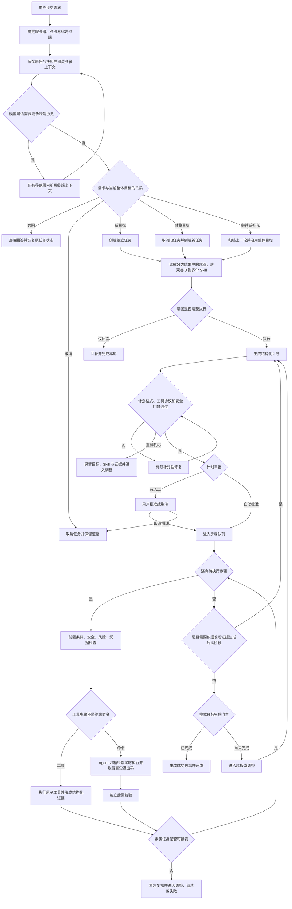
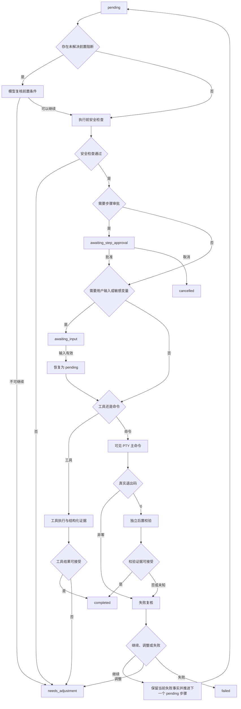
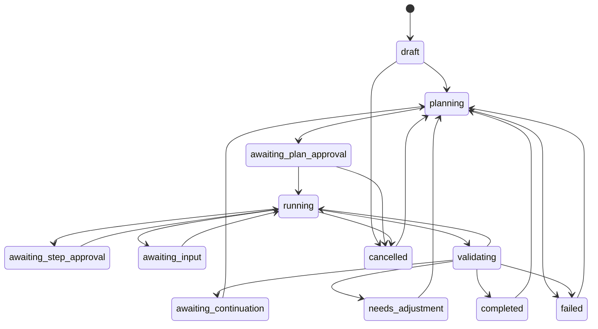

# Opsark 智能需求处理全流程说明

> 基线日期：2026-08-24
> 适用范围：从用户提交一条需求开始，到需求分类、Skill 选择、计划生成、审批、工具或终端执行、长任务监控、独立校验、调整、续接、完成、失败与取消的完整流程。
> 说明：本文以当前源码为基线。第 2～19 节定义系统应遵守的统一流程契约，第 20 节逐项列出当前实现与契约之间尚未闭环的差异，不能把“目标流程”误认为“当前已全部可靠实现”。
>
> 2026-08-29 终端架构更新：本文原有“Agent 绑定用户可见 PTY”描述为旧实现，不再是目标契约。当前迁移和最终边界以 [Agent 沙箱终端与执行链路整体优化计划](./AGENT_SANDBOX_TERMINAL_REFACTOR_PLAN.md) 为准：用户 Shell 永不接受 Agent 注入，Agent 使用独立会话。

快速阅读：

- 产品与交互：第 2～8、18、19 节。
- 模型、Skill、工具与凭据：第 5、6、9、10 节。
- 终端、长任务和校验：第 11～15 节。
- 状态机与历史：第 16、17 节。
- 当前缺口与回归验收：第 20、21 节。

## 1. 文档目标

本文回答以下问题：

1. 用户发来一条需求后，系统先做什么、后做什么。
2. 新目标、继续原目标、补充条件、旁问、替换目标和取消目标分别如何处理。
3. 模型、Skill、原子工具、Shell 命令各自负责什么。
4. 三种授权模式何时自动执行，何时必须等待用户确认。
5. 命令、工具、敏感输入、长任务、后置校验分别如何推进。
6. 模型异常、计划不合法、凭据缺失、网络失败、终端卡住、校验失败等情况如何收口。
7. 什么条件下可以宣布成功，什么情况只能暂停、调整或失败。

本文可作为产品交互、状态机实现、测试用例和后续重构的共同流程基线。

这里的“各种情况”指核心执行器能够遇到的控制流分支；具体业务类型可以持续通过可配置 Skill 扩展，不应把某个部署、SSH 或文件传输案例硬编码进核心状态机。

## 2. 核心原则

整个流程必须始终遵守以下原则：

1. **整体目标稳定**：`rootGoal` 表示任务最终要达成的结果；“继续”“重试”“补充信息”只能更新本轮指令，不能悄悄替换整体目标。
2. **Skill 只提供领域方法**：Skill 告诉模型某类业务通常应按什么阶段处理，但不直接执行命令，也不能绕过权限、安全和证据门禁。
3. **核心能力原子化**：服务器信息、连接资料、用户输入、目录树、文件读取、软件检查、SSH 跳转和文件传输由独立工具承担。
4. **执行平面隔离**：用户 Shell PTY 只接受用户输入；Agent 命令在每任务独立的可见沙箱终端执行。无沙箱会话时只能回退到独立无状态 SSH exec，不得回退为向用户 PTY 注入。
5. **真实退出优先**：看到输出不等于命令结束；必须取得当前执行 ID 对应的真实结束标记和退出码。
6. **独立校验**：主命令成功后才运行独立、只读的后置校验；主命令输出不能直接冒充校验结果。
7. **计划结束不等于目标完成**：当前计划全部处理完后，还必须通过整体目标完成门禁。
8. **失败事实不可改写**：模型可以解释失败并建议继续或调整，但不能把非零退出、协议不完整、认证失败等硬事实改成成功。
9. **高风险始终人工确认**：无论授权模式如何，高风险或确定性破坏操作都必须由用户逐步确认。
10. **敏感值不进入模型**：模型只看到变量名、用途和 `${secret.KEY}` 占位符；真实值只在执行边界注入。
11. **取消不是成功**：用户终止或规则中断后，步骤和任务不能被标记为完成，也不能继续下发后续命令。
12. **失败关闭**：安全分析器、终端协议或证据链无法确认时，停止执行并进入调整或失败，而不是猜测成功。

## 3. 一页总流程



## 4. 需求进入与任务归属

### 4.1 接收需求前

系统先完成以下准备：

1. 恢复模型 API Key、服务器密码和任务敏感变量。
2. 根据当前服务器和用户选中的任务决定复用任务还是创建新任务。
3. 为任务绑定一个终端 pane；后续命令必须回到这个绑定终端。
4. 保存提交前的任务状态、权限、模型、当前计划和上一轮证据，便于旁问恢复或新目标分流。
5. 将任务置为 `planning`，显示“正在理解需求并汇总服务器上下文…”。

如果任务正处于 `needs_adjustment` 或 `awaiting_continuation`，且用户只输入“调整”“生成调整计划”“重试”等明确短语，系统直接针对原整体目标生成调整方案，不重新做完整需求分类。

### 4.2 需求关系的六种情况

| 关系 | 含义 | 系统动作 | 原任务结果 |
|---|---|---|---|
| `new_goal` | 与当前任务无关的新目标 | 创建独立任务并重新选择 Skill、生成计划 | 原任务恢复主要工作流字段 |
| `continue` | 继续、重试原目标 | 归档上一轮，沿用 `rootGoal`，生成新一轮计划 | 原目标和证据保留 |
| `supplement` | 给原目标增加条件或资料 | 与 `continue` 一样归档上一轮、创建新 `roundId`、清空当前计划并重规划，同时更新 `currentInstruction`、合并 Skill | 原目标和证据保留 |
| `side_question` | 执行过程中临时问一个问题 | 直接回答，不改变执行队列 | 恢复提交前的状态、时间、权限和模型等主要工作流字段 |
| `replace_goal` | 明确放弃旧目标并改做另一件事 | 旧任务取消，新建任务 | 旧证据保留 |
| `cancel_goal` | 明确取消当前整体目标 | 取消当前任务 | 计划和证据保留 |

模型优先返回关系；模型未明确返回时，程序使用以下兜底：

- 没有 `rootGoal`：视为 `new_goal`。
- “继续、继续部署、重试、再试一次”等：视为 `continue`。
- 精确的“取消/终止/放弃当前任务”：视为 `cancel_goal`。
- 咨询意图：视为 `side_question`。
- 其他执行意图：视为 `new_goal`。

### 4.3 用户突然问了其他问题

系统不能因为聊天发生在同一个面板，就默认它仍属于原目标：

- “这个报错是什么意思？”通常是 `side_question`，回答后原任务继续保持暂停或运行前状态。
- “帮我检查另一台服务器”通常是 `new_goal`，创建独立任务，不覆盖原部署目标。
- “不要部署了，改为只检查环境”通常是 `replace_goal`。
- “继续部署，但不要修改数据库”属于 `supplement`，整体目标仍是部署，新增只读或禁止变更约束。

## 5. 模型上下文与终端历史

### 5.1 常规上下文

模型可接收以下脱敏信息：

- 当前服务器基础信息和实时指标。
- 授权模式与执行约束。
- 最近 24 条非纯系统会话。
- 上一轮计划、步骤结果和结构化证据摘要。
- 稳定的 `rootGoal` 与本轮 `currentInstruction`。
- 已完成步骤中可复用的事实。当前只有源码获取和项目构建有专属 Skill 事实提取器，其他 Skill 主要复用通用步骤证据。
- 已启用工具目录。
- 轻量 Skill 目录及当前激活 Skill ID。
- 当前服务器范围的敏感变量元数据，不含真实值。

### 5.2 终端上下文的三种情况

| 情况 | 处理方式 |
|---|---|
| 模型不需要历史终端 | 不发送终端正文，只使用常规上下文 |
| 用户标注了一段终端内容 | 优先发送该范围；模型仍无法判断时直接提示范围不足，不擅自扩大到未选择内容 |
| 模型主动要求更多历史 | 每轮至少增加 40 行，最多查看最近 400 行，总尝试不超过 4 轮 |

到达上限仍不足时，需求不能继续规划，应明确报告“现有终端历史不足”，而不是生成猜测计划。

### 5.3 敏感信息要求

- 终端历史、步骤输出、工具结果在进入模型前必须脱敏。
- 选中范围和自动范围必须使用同一套脱敏结果。
- URL 中凭据、令牌形态、已知真实密码和系统变量值均不得进入上下文。

## 6. 意图、Skill 与计划生成

### 6.1 三种意图

| 意图 | 适用情况 | 后续 |
|---|---|---|
| `answer` | 不需要读取真实环境即可回答 | 直接回答；新任务完成，旁问恢复原任务 |
| `execute` | 需要查看服务器真实状态、执行只读检查或实施变更 | 进入 Skill 选择和计划生成 |
| `terminal_context` | 当前信息不足，需要更多终端历史 | 返回上下文扩展流程，不生成计划 |

“查看数据库有哪些库”“检查服务为何未启动”虽然是查询，但需要真实服务器证据，应走 `execute` 的只读计划，而不是凭常识回答。

### 6.2 Skill 选择流程


规则如下：

1. 模型可以不选 Skill，也可以组合多个 Skill。
2. `continue` 和 `supplement` 保留仍启用的既有 Skill，并允许追加新 Skill。
3. `new_goal` 和 `replace_goal` 重新选择 Skill。
4. 禁用、未知或重复的 Skill ID 不能进入执行上下文。
5. Skill 的语义匹配和 `regex:` 规则只是选择提示，最终由模型结合完整需求选择。
6. Skill 不能输出最终成功事实；成功仍由真实执行与校验证据决定。
7. 内置 Skill 可以声明不可被用户覆盖的 `forbiddenToolIds`；规划和执行分派都必须校验，命中时 fail closed，不能回落为 Shell。

当前内置领域 Skill：

- 终端 SSH 跳转。
- 项目源码获取。
- 通用软件安装。
- 项目依赖与构建。
- 数据库检查与操作。
- 应用部署与上线验收。
- 文件传输与完整性验证。

`project-source-acquisition` v10 只保留五段必要流程：准备、认证、获取、验收和错误处理。Skill 不再指定某种唯一 Shell 写法，只要求源码最终位于用户目标目录、服务器凭据组被正确复用、真实失败不被改写，以及工作树/origin/HEAD/ref 得到真实验收。普通 Shell 计划步骤必须给出简短、独立、能读取对应状态的 validation，不能使用 `true`、`:`、`exit 0` 或 `/bin/true`。

该 Skill 的 HTTPS 认证状态机只消费当前服务器上下文中的 `serverCredentialGroups`，明确禁止 `server.resolve_connection` 和 `server.connect`：这两个工具用于 SSH 服务器登录，不是 Git HTTPS 凭据查询。只有真实探测证明需要认证且本服务器没有匹配组时，才能请求新输入。

### 6.3 计划生成分层

后端内部把需求理解与计划生成拆成两个阶段。意图、需求关系、执行约束和 Skill ID 属于同一次分类响应，不是先选择 Skill、再单独判断意图：

1. **分类阶段**：判断意图、需求关系、执行约束和 Skill 选择。
2. **规划阶段**：仅注入所选 Skill 的完整说明，生成当前证据允许的步骤。

每个计划步骤必须包含：

- `title`：步骤名称。
- `description`：为什么做、做什么。
- `command`：一个 Shell 命令或一个原子工具调用。
- `expected`：预期获得的真实结果。
- `validation`：独立、只读、能够验证 `expected` 的命令。
- `risk`：`low`、`medium` 或 `high`。

计划不是一次性覆盖整个复杂目标。部署类需求通常按以下阶段逐步生成：

1. 发现项目结构和说明文件。
2. 根据真实证据确认技术栈和软件缺口。
3. 获取或安装依赖。
4. 构建与配置。
5. 启动、托管和端到端验收。

每个发现阶段完成后，再把真实证据交给模型生成下一阶段，减少猜测和无效大计划。

### 6.4 计划安全校验与重试

计划校验分两层进行：

1. Rust 模型边界主要检查 JSON、计划字段、工具命令形态、JSON 参数对象、部分 `server.connect` 凭据形态、安全结构、长度和风险。
2. 前端规范化和 dispatch 再依据真实工具目录检查工具 ID、完整参数 schema、未知字段、standalone 规则和执行能力。

整体需要检查：

- JSON、字段和长度是否合法。
- 是否有空步骤、重复命令或无业务意义的 validation。
- 工具命令形态、参数对象，以及真实工具 ID、类型、必填项和 standalone 规则是否合法。
- 当前 active Skill 的 `forbiddenToolIds` 是否被计划或执行步骤违反。
- 是否启动脱管后台进程。
- validation 是否会阻塞等待输入。
- command 或 validation 是否用 `|| true`、尾部 `true`、失败分支 `exit 0`、错误管道等掩盖真实退出码。
- 风险是否被模型低估；程序只能抬高风险，不能降低风险。
- 只读需求是否夹带变更步骤。

可机械修复的问题先规范化；Rust 规划阶段仍有问题时，携带上一版计划和具体字段错误进行有限的针对性重试。当前计划生成最多三轮，即初次生成加两轮定向修复。

当前实现存在两个兼容行为，需要在后续收口：

- 前端发现未知工具 ID 或完整 schema 错误时，可能直接落入外层失败，而不会回到上述三轮计划修复。
- 计划同时包含 standalone 和其他待执行步骤时，规范化器会保留第一个 standalone 并移除其他 pending 步骤，而不是明确拒绝整份计划。

重试仍失败时：

- 不执行任何命令。
- 保留整体目标、已选 Skill、已有阶段证据和最终错误。
- 任务进入 `needs_adjustment`。
- 完全托管模式在 5 秒倒计时后尝试生成调整方案；其他模式等待用户操作。

### 6.5 模型异常

当前重试层级：分类 JSON 结构错误允许额外修复 1 次；模型传输层对暂态网络、429 或 5xx 最多尝试 3 次；计划内容校验为初次生成加两轮定向修复。三者相互独立，不能用无限重试掩盖稳定错误。

| 异常 | 处理 |
|---|---|
| API Key 或模型配置缺失 | 直接失败并提示修复配置 |
| JSON 无法解析 | 有限格式重试，耗尽后失败 |
| 响应体读取不完整、429、5xx、暂态网络错误 | 后端有限传输重试，仍失败则保留错误 |
| 模型返回空计划 | 执行意图下视为计划失败，不宣称完成 |
| 计划只包含未经请求的变更 | 过滤后为空则安全拒绝 |
| 安全分析器不可用 | fail closed，进入调整，不下发命令 |

## 7. 审批流程

### 7.1 三种授权模式

| 授权模式 | 计划审批 | 低风险步骤 | 中风险步骤 | 高风险步骤 |
|---|---|---:|---:|---:|
| `observe`（逐步确认） | 用户手动 | 手动 | 手动 | 手动 |
| `safe`（安全模式） | 用户手动 | 自动 | 手动 | 手动 |
| `managed`（完全托管） | 自动 | 自动 | 自动 | 手动 |

### 7.2 强制人工确认

以下操作无论模式和模型风险如何，都必须人工确认：

- `rm -rf`、格式化磁盘、分区等破坏性文件系统操作。
- 删除用户、清空防火墙规则。
- `DROP DATABASE/TABLE`、`TRUNCATE TABLE`。
- 关机、重启。
- 其他被确定性规则识别为高风险的命令。

### 7.3 计划规范化与步骤批准快照

计划批准与步骤批准不是同一份快照：

- 手动批准计划前若安全规范化修改了命令或 validation，必须展示最终版本并要求重新确认计划。
- 需要逐步骤审批的步骤，会保存精确的 `command + validation + risk` 快照；其中任一字段变化，旧步骤批准立即失效。
- 自动执行的低风险步骤没有同等的逐步骤批准快照，仍依赖执行前最终安全门禁。
- 完全托管可以自动批准规范化后的低、中风险步骤，但不能越过高风险确认。

## 8. 单个步骤的完整生命周期



### 8.1 前置阻断

如果前面的只读检查已确认阻断，例如网络不可达、认证缺失、磁盘不足，而后面的步骤准备修改系统，系统必须先复核阻断是否已解除：

- 已有成功变更证据明确解除阻断：允许继续。
- 模型结合证据明确认为后续步骤本身可以修复阻断：允许继续。
- 没有解除证据、模型不可用或剩余步骤无修复能力：进入 `needs_adjustment`。

### 8.2 最终执行前安全检查

普通 Shell 步骤至少检查两次：

1. 进入执行队列前检查模板命令和 validation，可修复安全的退出码传播问题。
2. 敏感变量合并后，对最终命令再次检查；此时不再自动改写。

第二次仍不安全时，命令不得发送到服务器。

## 9. 工具步骤

### 9.1 工具协议

规范格式：

```text
opsark-tool <tool-id> {"key":"value"}
```

当前也兼容 `--key value` 参数，但 JSON 对象是推荐且最稳定的格式。执行前校验工具 ID、启用状态、参数类型、必填项、未知字段、范围和数组长度。无法解析的工具命令不能回落成 Shell 执行。

### 9.2 工具目录

| 工具 | 用途 | 阶段规则 | 执行通道与当前状态 |
|---|---|---|---|
| `server.basic_info` | 获取系统、硬件和软件环境快照 | 常规继续 | 目录可见；当前通用工具执行器没有外部 adapter |
| `server.realtime_metrics` | 获取 CPU、内存、磁盘和网络采样 | 常规继续 | 目录可见；当前通用工具执行器没有外部 adapter |
| `server.resolve_connection` | 查询已纳管服务器或当前服务器保存的 SSH 凭据组引用 | 独立发现；active Skill 下细化；源码获取 Skill 显式禁用 | 本地，可调用 |
| `server.connect` | 验证目标 SSH 并切换任务的显式 Agent execution target | 独立发现；active Skill 下细化；源码获取 Skill 显式禁用 | 独立 SSH 探测 + AgentSession，可调用 |
| `secret.metadata` | 管理敏感变量元数据 | 常规继续 | 目录可见；当前通用工具执行器没有外部 adapter |
| `secret.merge_command` | 执行边界合并敏感占位符 | 常规继续 | 目录可见；当前通用工具执行器没有外部 adapter |
| `user.request_input` | 向用户收集缺失参数 | 必须独立执行；始终细化 | 用户表单，可调用 |
| `files.get_structure` | 获取紧凑目录树 | 独立发现；active Skill 下细化 | 本地/SFTP，可调用 |
| `files.read_content` | 有界读取 UTF-8 文本文件 | 独立发现；active Skill 下细化 | 本地/SFTP，可调用 |
| `software.check` | 检查软件路径和版本 | 独立发现；active Skill 下细化 | 独立 SSH exec，可调用 |
| `files.transfer_between_servers` | 使用受管凭据流式中转并校验文件 | 常规继续 | 桌面后端，可调用 |

### 9.3 standalone 工具

流程契约要求 `planMode=standalone` 的工具是当前阶段唯一待执行步骤。当前规范化器发现混合计划时会保留第一个 standalone 并移除其他 pending 步骤；后续应改为明确校验结果并记录被移除原因。独立执行的原因是工具结果会改变下一阶段规划依据，例如：

1. 先获取目录树。
2. 根据目录树选择 README、依赖声明或配置文件。
3. 再读取内容并生成构建计划。

工具成功且 `completionMode=refine` 时，是否生成下一阶段还受 `refinementScope` 约束：`user.request_input` 始终细化；连接资料、SSH 跳转、目录结构、文件读取和软件检查只有任务存在 active Skill 时才细化。自动细化统一最多 8 次。工具失败则形成结构化失败证据并进入调整，不能把“工具已调用”当作目标完成。

## 10. 用户输入与敏感变量

### 10.1 三类凭据通道

系统中的凭据分为三类，不能相互替代：

| 通道 | 用途 | 模型可见内容 | 取值边界 |
|---|---|---|---|
| 模型 API Key | 调用大模型 | 仅知道是否已配置 | 按模型配置从系统凭据存储恢复 |
| 服务器登录凭据 | 登录纳管服务器或 SSH 跳转 | 已纳管记录可显示公开用户名；敏感凭据组只显示是否可用、占位符和不可逆 `credentialRef` | `credentialRef` 必须与目标 host/port 匹配 |
| 服务器敏感信息 | 数据库账号/密码、Git 用户名/令牌、服务访问凭据等 | key、用途、`${secret.KEY}` 和凭据组元数据 | 按当前服务器长期保存；任何新任务均可按用途复用 |

凭据恢复采用部分成功语义：某个模型 Key 或服务器密码恢复失败，不应抹掉其他已成功恢复的凭据；真正使用到失败项时再给出针对性提示。

`server.connect` 有两条合法凭据路径：

- 首选使用与目标 host/port 精确匹配的 `managed-server:<id>` 或 `server-credential:<id>`。后者在执行器内同时解析凭据组的用户名和密码，工具结果不回传真实值。
- 仅为兼容旧流程，可同时提供 `username + passwordSecretKey`；passwordSecretKey 只引用当前服务器作用域中已安全收集的变量。

### 10.2 何时请求输入

仅在以下条件同时成立时调用 `user.request_input`：

1. 当前目标确实缺少必要参数。
2. 参数不能从服务器管理、敏感信息管理或其他工具中获取。
3. 不获得该参数就无法安全继续。

用户输入步骤必须是当前计划唯一的信息收集步骤。当前 schema 强制每个字段提供 key、显示名称、用途说明、类型、必填状态；placeholder 可选。用户名+密码/令牌表单还必须在两个 `password` 字段上显式提供相同的 `credential.group`、`credential.kind`、`credential.target` 和互补的 `credential.role=username|secret`。不完整、目标不一致、同角色重复或一次混入多组都在执行前 fail closed。字段的 key、label 和 description 只用于显示与旧数据兼容，不再决定新表单如何配对。

统一产品契约还要求输入区说明本次提交将解锁哪个步骤：

- 参数名称。
- 参数是什么。
- 为什么需要。
- 将解锁哪个步骤。
- 输入示例或格式（有明确格式时提供）。
- 是否必填。
- 是否属于敏感值。

### 10.3 敏感变量生命周期

1. 模型在计划中使用 `${secret.KEY}`，不写真实值。
2. 系统按当前服务器查找 `KEY` 的元数据和值。
3. 当前服务器已有值且用途匹配时，新任务和新一轮任务直接复用；不使用任务级“本轮确认”作为额外门禁。
4. 仅当服务器中真实缺失、用途不匹配或多个凭据组无法唯一选择时，步骤才进入 `awaiting_input`。
5. 用户提交用户名+密码/令牌时，两个真实值都保存到系统钥匙串，元数据按服务器保存稳定 `credentialGroupId`、认证类型、字段角色、目标和用途。
6. 模型和普通日志只得到 `${secret.KEY}`、`server-credential:<id>` 与脱敏元数据，不得到用户名或密码/令牌真实值。
7. 步骤恢复为 `pending` 后直接回到 `runStep`：重新核验用途、dispatch、既有审批快照以及敏感值合并后的最终安全门禁。
8. 真实值只在执行边界使用：Git HTTPS 由 PTY 使用同一凭据组分别响应 Username 和 Password；SSH/SCP 用户名经严格字符校验后才在 `user@host` 位置展开，密码仅由 PTY 提示响应通道注入。不得把密码/令牌写入 URL、环境变量、`GIT_ASKPASS`/`SSH_ASKPASS` 脚本、进程参数或持久化凭据文件。

#### 10.3.1 服务器凭据组

- 凭据组是服务器级长期资产，任务只引用，不拥有凭据。
- 同一组的 `username` 和 `secret` 字段必须成对使用；孤立字段不得注入。
- 同一主机可保存多个账号，各组使用不同变量 key；无法唯一匹配时禁止猜测。
- 更新同一账号的令牌会更新原组；提交不同用户名则创建新组，不覆盖或借用其他组的令牌。
- 升级时只会把同一历史输入卡原子提交的两个孤立敏感项迁移为一组；不会仅凭变量名把不同任务或不同用途的值拼在一起。
- 删除凭据组任一字段时，同组用户名和密码/令牌一并从钥匙串删除，避免孤立值被误用。

### 10.4 用途匹配

敏感变量不能只按名称复用，必须校验用途。例如：

- “用于登录 192.168.1.237 的 SSH 密码”不能自动用作 MySQL root 密码。
- 数据库密码、Git 令牌、SSH 密码应使用不同的语义 key 和说明。
- 用途冲突时进入调整或请求新的明确参数，不尝试错误认证。

认证失败只能证明认证未通过，不能当作“数据库列表查询完成”或“SSH 跳转成功”。当前用途匹配器仍是关键词分类启发式，任一侧落入 `generic` 时可能无法识别冲突，因此它是辅助门禁，不是完整语义保证。

## 11. 普通命令与 Agent 沙箱终端协议

### 11.1 命令进入执行器前

1. 从任务的 `executionTargetServerId ?? serverId` 解析明确目标，不读取用户当前 Shell 的跳转状态。
2. 为任务创建或恢复独立 `AgentSession`；同一会话一次只允许一个 executionId。
3. 根据 `executionScope` 重放结构化 cwd、非敏感环境变量和 sourceFiles，或创建 fresh shell。
4. Agent 沙箱终端显示脱敏命令；用户 Shell 仍可输入、切换目录、运行前台程序或关闭标签。
5. 功能开关关闭时只允许回退到独立无状态 SSH exec，禁止回退为用户 PTY 注入。

### 11.2 完成与中断协议

- 后端为每条主命令和 validation 分配独立 executionId，返回真实退出码并限制输出大小。
- AgentSessionContext 只保存可校验、可重放的非敏感结构；凭据通过运行期提示响应通道提供。
- Git HTTPS 用户名/密码提示由 SSH 执行器确定性识别、核对 target 并各响应一次；重复提示视为认证拒绝。
- 中断先标记当前 executionId，再通过独立 SSH 通道终止远程进程组；无法确认副作用时先发现真实状态，不盲目重放。
- transport 失败会推进 Agent generation。仅明确未发送的命令可自动重放一次，副作用不确定时进入状态核验。
- validation 使用独立 executionId，并按 `validationScope` 进入 isolated exec、fresh interactive/login shell 或其他明确作用域。

### 11.3 实时输出

- 输出按块接收并实时显示在独立 Agent 沙箱终端。
- ANSI 控制序列和内部协议标记不进入普通任务记录。
- 敏感值在终端流、步骤输出和审计写入前脱敏。
- `\r` 下载进度按覆盖语义处理，避免同一进度生成大量行。
- 用户手动滚到历史位置时暂停自动跟随；回到底部后继续跟随最新 Agent 输出。
- Agent 输出不会写入用户 Xterm，也不会锁定用户键盘。

## 12. 长任务监控

### 12.1 两类任务

| 类型 | 示例 | 等待规则 |
|---|---|---|
| `bounded` 普通有界命令 | `stat`、`grep`、`hostname`、短检查 | 90 秒仍无真实退出则规则中断 |
| `progressive` 渐进任务 | 下载、安装、构建、`git clone`、`scp`、`docker build` | 有真实进度可继续；连续无进展达到上限后中断 |

### 12.2 每 30 秒模型复核

长任务监控从 30 秒开始每 30 秒请求一次模型建议，但正式后置校验绝不与主命令并发。

用户可见的过程通知约在 30 秒首次出现，之后每 60 秒提示一次；模型复核仍按 30 秒周期进行。周期模型复核调用失败不会立即把正在运行的命令判失败，而是记录告警并由真实退出、无进展规则或硬上限接管。

模型只接收精简上下文：

- 整体目标最多 1200 字符。
- 当前命令最多 800 字符，并带指纹。
- 本轮新增终端输出最多 1200 字符。
- 单行最多 360 字符。
- 关键错误、警告和里程碑最多 600 字符。
- 仅包含当前步骤、进度状态和下一个步骤，不发送完整历史计划。

输出处理规则：

- 清理 ANSI、spinner、无意义空行和连续重复行。
- 百分比、ETA、速度等连续进度只保留最新状态。
- 正常情况下只发送上轮之后的增量。
- 终端缓冲滚动或内容重写时执行有界 `resync`。
- 使用输出指纹和最后变化时间识别“看似有输出但没有语义进展”。

### 12.3 模型决策边界

- `continue`：只表示继续等待当前命令，不能进入下一步。
- `adjust`：中断当前命令，保留证据并进入调整。
- `complete`：主命令未真实结束且独立校验未通过时无效，只能继续等待。

等待不能无限续期：

- 普通有界命令无进展时，模型连续 `continue` 最多 2 轮。
- 渐进任务连续 4 个复核轮次无进展，或无进展状态下连续 `continue` 达 4 轮，规则中断。
- 从第 2 个无进展轮次开始，明确告诉模型“已连续至少 60 秒无进展”。

## 13. 主命令结果与独立后置校验

### 13.1 主命令退出分支

| 结果 | 处理 |
|---|---|
| 执行器判定 `result.success=true` | 进入独立后置校验；直接后端适配器可把部分诊断命令的退出码 1 + 空输出解释为有效空结果 |
| 非零退出 | 保留失败事实，进行一次异常模型复核 |
| 退出码 130 | 视为取消或中断，不运行后置校验 |
| 没有收到结束标记 | 协议不完整，不能判成功 |
| 长任务规则要求调整 | 请求中断并最多等待 5 秒；若未确认释放则保留命令槽并标记终端待恢复，再进入调整 |

### 13.2 后置校验

后置校验必须：

- 与主命令独立执行。
- 只读。
- 能直接验证 `expected`。
- 保留真实退出码。
- 不依赖主命令 Shell 中的临时变量或管道输出。

对可能最终一致的状态，系统执行有界稳定窗口：首次校验失败后，分别等待 500ms、1.5s、3s 再试，最多共 4 次。退出码 2、126、127 通常表示语法错误、不可执行或命令不存在，不作为暂态重试。

### 13.3 证据判定

一个步骤的结果同时区分：

- `executionStatus`：`success`、`failed`、`cancelled`、`blocked`。
- `observationStatus`：`matched`、`not_found`、`healthy`、`unhealthy`、`warning`、`unknown`。

因此“命令执行成功”不一定代表“观察结果健康”。例如：

- `grep/pgrep` 没找到进程时，诊断观察可被解释为 `not_found`；AgentSession 或独立 exec 仍保留真实退出码 1，不能笼统称主命令成功。
- MySQL 返回认证失败：执行失败或阻断，不能解释为数据库不存在。
- `test -f` 确认文件为空：命令成功，但业务结论可能是文件不完整。

### 13.4 何时调用异常模型复核

仅在程序证据不能直接收口时调用一次模型复核：

- 主命令真实非零退出。
- 主命令成功但后置校验失败。
- 校验协议没有取得真实结束标记。
- 程序证据相互冲突或需要领域解释。
- 变更步骤前存在未解除的阻断证据。

模型可建议 `continue`、`adjust` 或在严格条件下 `complete`，但以下硬事实不能被覆盖：

- 校验协议不完整。
- 校验命令不存在或不可执行。
- 平台、架构或 ABI 已确认不兼容。
- 网络或下载已确认失败。
- 变更失败且剩余计划没有明确修复步骤。

认证失败属于主命令失败事实：模型可以据此建议获取正确凭据或调整连接方式，但不能把认证失败解释成业务查询成功。

## 14. 计划推进、发现细化与调整

### 14.1 当前步骤处理完后

1. 当前计划还有 `pending` 步骤：执行第一个。
2. 最后一步是 `completionMode=refine` 的发现工具：依据新证据生成后续阶段。
3. 当前阶段全部是只读发现，而整体目标仍要求变更：生成一次“变更 + 验收”后续计划。
4. 其他情况：进入整体目标完成门禁。

同一阶段细化时会过滤已经执行过的相同命令，防止重复发现。

### 14.2 调整的触发条件

- 计划生成或执行前安全门禁未通过。
- 工具或 Shell 主命令失败。
- 后置校验失败或协议不完整。
- 长任务无进展或模型建议停止等待。
- 缺少网络、凭据、软件或其他前置条件。

“当前阶段成功但整体目标仍缺必要步骤”首先进入 `awaiting_continuation`，属于证据驱动的后续阶段，不应混成普通失败调整。

### 14.3 调整流程

1. 保留失败步骤、真实输出、结构化证据和未完成目标。
2. 只向模型发送必要信息：整体目标、当前指令、执行约束、已选 Skill、上一计划和失败结论。
3. 生成替代步骤或下一阶段步骤。
4. 新计划重新经过格式、安全和风险校验。
5. 只有调整计划成功后，才将旧活动计划归档到 `phaseHistory` 并替换为新计划；生成失败时原计划仍保持活动状态。
6. 进入计划审批；完全托管自动批准计划，但高风险步骤仍单独确认。

若触发原因是确定性安全门禁，调整还有更窄的局部修改约束：只能返回一个替代步骤；`title`、`description`、`expected`、`risk` 不变；只能修改被命中的 `command` 或 `validation` 字段。

防循环规则：

- 单个调整周期最多生成一次，手动和托管调整都受 `adjustmentCount` 限制。
- 阻塞原因发生变化时可以开启下一周期。
- 相同阻塞原因再次出现时停止重复规划并转为失败，要求先解决外部条件。

## 15. 整体目标完成门禁

当前计划队列清空后，系统必须使用以下信息复核整个任务：

- `rootGoal`。
- 本轮 `currentInstruction` 和执行约束。
- `planHistory` 中已结束轮次。
- `phaseHistory` 中被调整替换的阶段。
- 当前计划的全部步骤、输出、结果和证据。
- 所有 active Skill 的最终验收要求。

只有同时满足以下条件才能 `completed`：

1. 用户要求的最终结果确实存在。
2. 必要的变更步骤真实成功。
3. 独立校验支持最终结论。
4. 没有未解除的阻断或失败步骤影响目标。
5. 所选 Skill 的最终验收条件均有证据。

以下情况不能宣布成功：

- 只克隆了源码，但用户目标是完成部署。
- 安装命令仍在下载，版本验证已经提前运行。
- SSH 工具返回 `connected=true`，但用户要求的是当前终端真正跳转而终端未改变。
- 文件传输命令结束，但目标字节数或 SHA-256 未核对。
- 数据库认证失败，却把“无法查询”写成“查询完成”。
- 模型认为输出看起来完整，但命令没有真实退出码。

整体目标未完成时，任务进入 `awaiting_continuation` 并保留已有成功证据；完全托管模式会在倒计时后生成有界后续计划，`observe/safe` 模式等待用户主动生成并批准。任何模式都不能丢失最初目标重新从零开始。

## 16. 完成、失败、取消与历史

### 16.1 三种本轮结果态

它们表示当前轮处理结果，不是无出边的绝对终点；用户后续仍可重新规划，`failed` 也可进入调整。

| 状态 | 条件 | 总结内容 |
|---|---|---|
| `completed` | 整体目标门禁通过 | 完成了什么、关键证据、最终地址或版本、必要警告 |
| `failed` | 重试耗尽、相同阻塞重复、模型/外部条件无法恢复 | 已完成事实、未完成目标、最终阻断、用户下一步 |
| `cancelled` | 用户取消目标、拒绝计划或终止业务 | 中断位置、已保留证据、未执行步骤 |

### 16.2 历史结构

- `plan`：当前活动阶段。
- `phaseHistory`：同一轮内因调整或重规划被替换的旧计划。
- `planHistory`：已结束的需求轮次，包含需求、计划、事件、总结、暂停原因和约束。
- `rootGoal`：跨轮次稳定保存的整体目标。
- `currentInstruction`：当前轮的增量指令。

同一轮内的明确“调整/重试”先形成新的 `phaseHistory`，不会立即形成新的 `planHistory`。汇总全部证据时，`allTaskSteps()` 合并三处步骤并按步骤 ID 去重；持久化裁剪后，应用重启后的目标门禁只能使用仍被保留的历史证据。

持久化采用有界压缩：常规最多保存 50 个任务、每任务 8 轮计划历史和 12 个阶段；空间不足时进一步压缩。持久化输出可能截断，但实时终端显示不受该截断影响。

### 16.3 取消与终止的统一目标语义

以下是统一流程契约；当前三个取消入口尚未完全等价，具体差异见第 20 节。

- **取消计划/任务**：停止后续步骤，清理待审批、结构化输入和敏感输入，保留已有证据。
- **终止正在运行的业务**：设置 `cancelRequested`，中断当前 AgentSession 进程组、独立后端命令或文件传输，活动步骤标为取消，后续异步结果不得再回写为成功；用户 Shell PTY 不参与 Agent 中断。
- **规划或模型复核期间取消**：模型晚到结果必须丢弃，不能把已取消任务重新转回审批或运行。

## 17. 任务与步骤状态机

### 17.1 任务状态

| 状态 | 含义 | 典型下一状态 |
|---|---|---|
| `draft` | 新建但未提交 | `planning`、`cancelled` |
| `planning` | 正在分类、选择 Skill 或生成计划 | `awaiting_plan_approval`、`needs_adjustment`、`failed` |
| `awaiting_plan_approval` | 等待计划批准 | `running`、`cancelled` |
| `running` | 正在推进步骤 | 审批、输入、校验、调整、完成或取消 |
| `awaiting_step_approval` | 当前步骤需单独确认 | `running`、`cancelled` |
| `awaiting_input` | 等待用户参数或凭据 | `running`、`cancelled` |
| `validating` | 正在校验步骤或整体目标 | `running`、`awaiting_continuation`、`needs_adjustment`、终态 |
| `awaiting_continuation` | 当前阶段成功但整体目标未完成 | `planning`、`awaiting_plan_approval` |
| `needs_adjustment` | 当前计划需替换或补充 | `planning`、`awaiting_plan_approval`、`failed` |
| `completed` | 整体目标已验收 | 新轮需求可重新进入 `planning` |
| `failed` | 当前任务无法继续 | 修复条件后可重新规划，或取消 |
| `cancelled` | 用户取消或终止 | 新轮需求可重新进入 `planning` |

源码允许的完整迁移如下；同状态写回也被允许：

| 当前状态 | 所有合法下一状态 |
|---|---|
| `draft` | `planning`、`cancelled` |
| `planning` | `awaiting_plan_approval`、`awaiting_continuation`、`needs_adjustment`、`completed`、`failed`、`cancelled` |
| `awaiting_plan_approval` | `running`、`cancelled`、`failed` |
| `running` | `planning`、`awaiting_step_approval`、`awaiting_input`、`validating`、`needs_adjustment`、`completed`、`failed`、`cancelled` |
| `awaiting_step_approval` | `running`、`cancelled`、`failed` |
| `awaiting_input` | `running`、`cancelled`、`failed` |
| `validating` | `running`、`awaiting_continuation`、`needs_adjustment`、`completed`、`failed`、`cancelled` |
| `awaiting_continuation` | `planning`、`awaiting_plan_approval`、`failed`、`cancelled` |
| `needs_adjustment` | `planning`、`awaiting_plan_approval`、`failed`、`cancelled` |
| `completed` | `planning` |
| `failed` | `planning`、`awaiting_plan_approval`、`needs_adjustment`、`cancelled` |
| `cancelled` | `planning` |

下面的图只展示主干，不替代上面的完整合法迁移表：



### 17.2 步骤状态

| 状态 | 含义 |
|---|---|
| `pending` | 等待执行 |
| `awaiting_approval` | 等待用户批准 |
| `awaiting_input` | 等待参数或敏感值 |
| `running` | 主命令或工具正在执行 |
| `validating` | 正在独立校验 |
| `completed` | 证据已接受 |
| `failed` | 执行、工具、协议或校验失败 |
| `skipped` | 因取消、终止或上游阻断而跳过 |

步骤的完整合法迁移如下；`completed`、`failed`、`skipped` 对单个步骤而言是终态：

| 当前状态 | 所有合法下一状态 |
|---|---|
| `pending` | `awaiting_approval`、`awaiting_input`、`running`、`failed`、`skipped` |
| `awaiting_approval` | `awaiting_input`、`running`、`failed`、`skipped` |
| `awaiting_input` | `pending`、`failed`、`skipped` |
| `running` | `validating`、`completed`、`failed`、`skipped` |
| `validating` | `completed`、`failed`、`skipped` |
| `completed` | 无 |
| `failed` | 无 |
| `skipped` | 无 |

## 18. 全场景异常处置矩阵

本节表示统一流程契约；若当前代码尚不符合，表内会标注“现状差异”，完整原因见第 20 节。

### 18.1 需求与规划

| 场景 | 必须表现 | 后续状态 |
|---|---|---|
| 没有可用模型 | 明确提示模型配置问题 | `failed` |
| API Key 未恢复 | 提示重新保存，不尝试空 Key | `failed` |
| 模型要求更多终端历史 | 有界扩展并显示范围 | `planning` |
| 终端历史达到上限仍不足 | 明确上下文不足 | `failed` 或 `needs_adjustment` |
| Skill 未匹配 | 使用通用运维规则 | 继续规划 |
| 多 Skill 匹配 | 合并完整说明和最终验收 | 继续规划 |
| Skill 被禁用或不存在 | 拒绝无效 ID | 继续重试或失败 |
| 计划使用 active Skill 禁止的工具 | 规划边界和执行分派双重拒绝，不回落 Shell | 定向修复；耗尽后 `needs_adjustment` |
| 计划 JSON 错误 | 有限格式重试 | 重试耗尽后失败 |
| Rust 规划阶段发现 validation 掩盖失败 | 定向修复，不下发命令 | 仍不合法则 `needs_adjustment` |
| 前端发现未知工具 ID 或完整参数 schema 错误 | 现状可能直接失败；目标应回送字段错误定向修复 | `failed` 或修复后继续 |
| 只读需求包含变更 | 过滤变更；为空则拒绝 | `failed` |

### 18.2 审批与输入

| 场景 | 必须表现 | 后续状态 |
|---|---|---|
| 用户拒绝计划 | 停止全部步骤并保留计划 | `cancelled` |
| 高风险步骤未确认 | 绝不自动执行 | `awaiting_step_approval` |
| 批准后命令被修改 | 原批准失效并展示最终内容 | `awaiting_step_approval` |
| 缺少普通参数 | 显示参数名称、用途和解锁说明 | `awaiting_input` |
| 服务器已有用途匹配凭据 | 直接引用，不重复询问 | 继续执行 |
| 缺少凭据 | password 输入；用户名/密码组按服务器长期保存，真实值不进模型 | `awaiting_input` |
| 凭据表单缺少或冲突 `credential` descriptor | 执行前拒绝，不通过中英文说明猜测配对 | `needs_adjustment` |
| 同一目标有多个凭据组 | 只选择已有组，不重新输入值 | `awaiting_input` 或选择后继续 |
| 必填项为空或数字非法 | 表单内提示，不离开等待态 | `awaiting_input` |
| 保存凭据失败 | 显示保存错误，不执行步骤 | `awaiting_input` |
| 敏感变量用途不匹配 | 不复用旧值，要求新参数 | `needs_adjustment` 或 `awaiting_input` |

### 18.3 工具

| 场景 | 必须表现 | 后续状态 |
|---|---|---|
| 工具命令格式错误 | 不作为 Shell 执行 | `needs_adjustment` |
| 工具不存在 | 结构化 `TOOL_NOT_FOUND` | `needs_adjustment` |
| 工具被禁用 | 结构化 `TOOL_DISABLED` | `needs_adjustment` |
| 参数类型或必填项错误 | 执行前拒绝 | `needs_adjustment` |
| 工具执行成功 | 形成结构化证据 | 下一步或发现细化 |
| 工具只返回部分/截断结果 | 先记录警告；是否缩小范围并细化取决于 `completionMode/refinementScope` | 步骤完成、继续或 `planning` |
| 目标服务器未纳管 | 先解析连接资料或请求用户输入 | `awaiting_input`/调整 |
| 文件传输被取消 | 临时文件不得提交为最终文件 | `cancelled` |

### 18.4 终端与命令

| 场景 | 必须表现 | 后续状态 |
|---|---|---|
| 绑定终端尚未连接 | 有界等待，不后台执行 | 目标为超时后调整；当前断连失败链仍需闭环 |
| 旧智能命令仍占用终端 | 等待释放或隔离恢复 | 不下发新命令 |
| 命令实时有输出 | 更新终端和步骤进度 | `running` |
| 命令非零退出 | 保留真实退出码并复核 | `needs_adjustment`/继续 |
| 命令无结束标记 | 不能判成功 | 目标为中断并调整；当前可能一直等到底层超时 |
| 终端断线 | 目标为当前命令失败或进入恢复；当前 capture 可能挂到超时 | 不继续后续步骤 |
| 交互认证提示且有匹配的服务器凭据组 | 受控注入成对用户名/密码，不显示真实值 | 继续等待真实退出 |
| 再次提示密码或无凭据 | 发送中断，转输入或调整 | 不无限等待 |
| 用户滚到历史位置 | 保持自由滚动；“有新输出”提示是目标体验，当前尚未完整实现 | `running` |

### 18.5 长任务与校验

| 场景 | 必须表现 | 后续状态 |
|---|---|---|
| 普通检查超过 90 秒 | 规则中断，不允许模型无限续期 | `needs_adjustment` |
| 下载/构建持续有进度 | 继续等待真实退出 | `running` |
| 渐进任务连续多轮无变化 | 中断并说明无进展 | `needs_adjustment` |
| 模型说 complete 但主命令未结束 | 忽略完成建议 | `running` |
| 主命令成功、校验尚未稳定 | 500ms/1.5s/3s 有界重试 | `validating` |
| validation 语法错误或命令不存在 | 不做暂态重试，再按证据复核和剩余修复步骤决定 | 继续、`needs_adjustment` 或失败 |
| 校验通道超时 | 标记协议不完整，绝不成功 | `needs_adjustment` |
| 程序证据明确通过 | 不调用模型解释 | 步骤 `completed` |
| 证据冲突 | 一次异常模型复核 | 继续或调整 |

### 18.6 调整、完成与取消

| 场景 | 必须表现 | 后续状态 |
|---|---|---|
| 完全托管遇到可恢复失败 | 5 秒后自动生成调整 | `planning` |
| 安全/逐步确认遇到失败 | 流程契约要求等待用户生成调整并批准 | `needs_adjustment` |
| 长任务模型直接返回 `adjust` | 现状三个模式都会立即调用调整；目标应统一按授权模式决定是否自动生成 | 调整中或 `needs_adjustment` |
| 调整计划含高风险步骤 | 即使托管也等待确认 | `awaiting_step_approval` |
| 调整仍是同一阻塞 | 停止重复生成 | `failed` |
| 当前阶段结束但目标未完成 | 保留证据；托管模式倒计时生成后续阶段，其他模式等待用户 | `awaiting_continuation` |
| 所有目标证据齐全 | 生成真实成功总结 | `completed` |
| 用户在执行中终止 | 中断当前执行并跳过后续步骤 | `cancelled` |
| 用户在模型调用期间取消 | 丢弃晚到模型结果 | `cancelled` |

### 18.7 典型需求的端到端走法

| 用户需求 | 典型流程 |
|---|---|
| “这个报错是什么意思” | 分类为 `answer/side_question` → 直接回答 → 恢复原任务主要工作流字段 |
| “查看 MySQL 有哪些数据库” | 只读执行意图 → 检查客户端和认证前提 → 缺数据库凭据则请求语义明确的新输入 → 执行查询 → 独立确认查询成功；认证失败不能算完成 |
| “SSH 跳转到 192.168.1.237” | 选择 SSH Skill → 检查网络 → `server.resolve_connection` → 唯一匹配凭据组则直接复用，确实缺失则同表单收集并长期保存用户名+密码 → `server.connect` 验证 SSH 并更新任务显式 execution target → 新 AgentSession 验证主机和用户；用户 Shell 不跳转 |
| “克隆 Gitee 私有仓库” | 选择源码获取 Skill → 用原始 URL 做非交互 `ls-remote` 分类 → 唯一匹配的服务器级 `git-https` 凭据组直接复用；真实缺失时用显式 descriptor 同表单收集 → Agent 凭据通道分别回答 Username/Password → 前台克隆 → 独立 scope 核验 remote/HEAD/ref |
| “把文件传到另一台服务器” | 确认源文件和 SHA-256 → 解析目标连接资料 → `managed-server` 引用可选受管中转，`server-credential` 引用走可见 PTY 前台 scp → 写临时目标 → 核对字节数和 SHA-256 → 原子提交最终文件 |
| “部署 /opt/project” | 目录树 → 有界读取 README/依赖声明 → 软件检查 → 安装缺失环境 → 安装依赖与构建 → 配置并启动托管服务 → 端口、HTTP、日志和依赖端到端验收 |
| “继续部署” | 关系为 `continue` → 保留原 `rootGoal` 和已成功证据 → 归档上一轮 → 只规划尚未完成阶段 |
| “先别部署，查一下磁盘” | 若只是临时咨询则 `side_question`；若明确改变目标则 `replace_goal`，不能由系统自行猜测 |
| “终止业务” | 进入统一中断流程 → 停止当前 Agent executionId/进程组 → 跳过后续步骤 → 生成取消总结；用户 Shell 不受影响 |

## 19. 用户界面展示规则

为避免出现连续多条“已生成 N 个步骤”“已根据失败结果生成 N 个调整步骤”，界面应遵循：

1. 每个需求轮次只保留一张当前可操作的计划状态卡。
2. 旧计划版本、模型复核轮次、心跳和计划替换全部降级到可展开执行记录。
3. 当前执行卡只展示：
   - 当前阶段。
   - 第几步/共几步。
   - 当前步骤名称和风险。
   - 运行耗时与是否有新进展。
   - 最近一条有效证据。
   - 为什么暂停。
   - 下一动作由系统还是用户完成。
4. 调整中只显示一个稳定状态：倒计时、生成中、等待审批或失败，不能同时显示“已排队”和“正在生成”。
5. 中断中明确显示：正在请求停止、等待退出确认、隔离旧终端、重连、已释放。
6. 聊天区只显示结论和用户需要做的事；技术细节进入执行记录和审计。

推荐文案：

- 运行：“正在执行第 2/5 步，已运行 67 秒；仍有新输出，继续等待真实退出。后置校验尚未开始。”
- 校验：“主命令已成功；目标状态尚未稳定，正在进行第 2/4 次独立校验。”
- 中断：“已请求停止当前命令，正在等待 Shell 返回退出码；确认前不会发送下一条命令。”
- 调整：“当前步骤未完成：网络下载失败。已保留输出证据，正在生成一次调整方案。”
- 重复阻塞：“相同网络阻塞再次出现，已停止重复规划。恢复网络后可继续原目标。”

## 20. 当前实现尚未闭环的问题

以下内容是代码核对发现的现状风险，不属于已经可靠完成的能力。

### 20.1 任务与续接

1. `awaiting_plan_approval`、`awaiting_step_approval`、`awaiting_input` 状态下如果直接提交新消息，当前实现可能先尝试非法迁移到 `planning`。
2. `side_question` 的用户消息仍可能被后续历史归档误认为上一轮执行需求。
3. `new_goal/replace_goal` 的关系分类和计划生成目前在同一次后端流程中完成，新目标计划上下文可能短暂携带旧 `rootGoal`。
4. 规划、调整或整体目标复核等待模型返回时取消，部分异步路径仍需统一的“取消后拒绝回写”门禁。
5. 三个取消入口目前不等价：`rejectTask()` 是本地取消，`terminateTask()` 会尝试中断远端，而消息关系 `cancel_goal` 当前主要修改任务状态，并不等价于远程终止。
6. `rejectTask()` 和 `terminateTask()` 会清理结构化 `pendingUserInputs`，但没有统一清理任务关联的 `pendingSecret`；等待敏感输入的步骤也不一定同步标为取消。

### 20.2 应用重启恢复

1. 持久化的 `planning/running/validating` 状态在应用重启后没有统一收敛为可恢复中断态。
2. `pendingUserInputs` 和 `pendingSecret` 都是内存状态，`awaiting_input` 任务重启后可能失去对应输入卡。
3. 旧 `currentExecutionId` 不会在启动时自动清理、重新挂接或核对远端进程。
4. `autoAdjustmentSeconds` 可持久化，但托管倒计时定时器不会自动重建，可能留下残余状态。
5. 当前没有完整“恢复原执行”入口，异常重启后通常只能终止、删除或另起一轮。

建议增加任务恢复状态或启动归一化：

```text
planning/running/validating（应用异常退出）
  → interrupted
  → 校验远端是否仍在执行
      → 可重新挂接
      → needs_adjustment
      → cancelled
```

### 20.3 终端协议与中断状态机（已收口）

当前实现已完成以下修复：

1. 智能命令改为 `READY → payload → BEGIN → END(exitCode)` 两阶段发送；只接受与当前 execution ID 一致的严格独立行标记。
2. 先执行 `stty -echo` 并收到 READY，再发送 Base64 载荷，不再用固定延迟猜测 Shell 是否就绪。
3. 后端每个 `terminal-output` 均携带单调 generation；前端只消费当前 generation，旧 PTY 的延迟输出不再污染新会话。
4. SSH 通道的部分写入和 `WouldBlock` 会保留未写字节并继续发送，不再出现键盘输入丢字符或长命令只传输一部分。
5. 命令或中断未在有界时间内返回 END 时，旧 PTY 会被隔离和关闭，系统创建新 generation，只有新 Shell 返回严格 recovery READY 后才释放命令槽。
6. 恢复尝试有上限；耗尽、组件卸载或会话删除都会清理命令、SSH 回调和输入锁，不再留下“有提示符但无法输入”的死槽。
7. 用户终止会等待真实 END；5 秒仍无 END 时启动隔离恢复，旧命令槽释放前禁止下一条智能命令抢占终端。
8. 终端通道故障归类为 `terminal_transport`/`terminal_recovery`，不消耗业务调整次数，不交给模型改写业务计划；同一终端 generation 最多自动重放一次确认“尚未发送”的原命令。

状态机统一为：

```text
running
  → interrupt_requested
  → awaiting_exit_marker
      → released
      → quarantined
          → closing_old_generation
          → reconnecting
          → released
```

只有 `released` 后才允许用户输入或发送下一条智能命令。

尚需通过真实 SSH 弱网、超长输入和远端强制断线场景做桌面端集成压测；这些属于环境验收，不再是未闭环的协议分支。

### 20.4 敏感信息与工具

1. 用户选中的终端文本目前存在原始字段与脱敏副本并存的路径，应统一只发送脱敏值。
2. 普通 Shell 的敏感占位符仍使用字符串替换合并；包含引号或 Shell 元字符时需要参数级安全注入。Git/SSH 交互凭据已不走该路径。
3. 凭据组目前按字段说明推导认证类型和目标，后续可在 `user.request_input` schema 中增加显式 `credentialKind/target`，减少启发式判断。
4. 部分本地内部工具虽然在目录中可见，但通用工具执行器没有外部 adapter；应避免模型生成不可调用步骤。
5. 工具副作用风险尚未完全由可信目录元数据决定，跨服务器覆盖等操作不能只依赖模型填写风险。
6. 已禁用工具更适合在规划或 dispatch 阶段直接拒绝，而不是执行时才报错。
7. 计划三轮生成耗尽后存在兼容 fallback：命令、validation 和风险安全完整时，部分缺失的展示字段可能由转换层补默认值后接受；这与“六字段严格必填”的目标契约不完全一致。

### 20.5 模式一致性

长任务模型复核直接触发 `adjust` 时，当前代码可能立即调用调整逻辑；这与安全/逐步确认模式通常等待用户操作的行为不完全一致。应统一定义：

- 是否自动生成调整，由授权模式决定。
- 是否自动批准调整计划，也由授权模式决定。
- 高风险步骤始终独立人工确认。

## 21. 验收清单

### 21.1 需求关系

- [ ] 新目标不会覆盖旧任务。
- [ ] 继续和补充不会丢失 `rootGoal`、计划和证据。
- [ ] 旁问回答后原任务状态完全恢复。
- [ ] 替换目标会取消旧任务并创建新任务。
- [ ] 取消目标会真正中断当前执行，而不只修改界面状态。

### 21.2 计划与审批

- [ ] JSON、工具协议、validation 和风险都有有限重试。
- [ ] 计划安全失败时没有任何命令进入终端。
- [ ] 计划或步骤内容改变后旧批准失效。
- [ ] 完全托管仅自动批准低、中风险，高风险仍需确认。
- [ ] 聊天区每轮只有一个当前计划状态消息。

### 21.3 工具与敏感输入

- [ ] standalone 工具不会和其他待执行步骤混在同一阶段。
- [ ] 工具失败不会回落到 Shell 或被判成功。
- [ ] 输入框明确说明每个参数及解锁用途。
- [ ] SSH、数据库、Git 等不同用途密码不会串用。
- [ ] command 和 validation 中的所有敏感占位符都经过确认。
- [ ] 模型、终端展示和审计均不出现真实敏感值。

### 21.4 命令、长任务与校验

- [x] 智能命令只在独立 AgentSession 或无状态 SSH exec 执行，不进入用户 PTY。
- [x] 每条命令只接受匹配 executionId、session 和 generation 的输出与结果。
- [ ] 用户滚动查看历史时不会被每个输出块强制拉回底部。
- [ ] 普通命令超过硬上限会中断，不会无限等待。
- [ ] 下载/构建只有在真实进度变化时才继续等待。
- [ ] 主命令结束前绝不运行正式后置校验。
- [ ] validation 失败、超时或缺少结束标记都不会判成功。
- [x] 用户终止后下一条命令不会进入旧 Agent generation。

### 21.5 整体目标

- [ ] 当前计划完成后仍执行整体目标门禁。
- [ ] 部署任务必须验证服务托管、端口和端到端访问。
- [ ] 文件传输必须验证目标字节数和 SHA-256。
- [x] `server.connect` 必须验证并更新任务的显式 Agent execution target，不修改用户终端。
- [ ] 失败总结明确区分“已完成事实”和“尚未完成目标”。
- [ ] 重启应用后，瞬态任务可明确恢复、调整或取消，不永久卡住。

## 22. 代码职责索引

| 职责 | 主要文件 |
|---|---|
| 任务主编排、需求提交、审批、执行、调整 | `src/stores/ops.ts` |
| 任务状态机 | `src/features/agent/taskMachine.ts` |
| 步骤状态机 | `src/features/agent/stepMachine.ts` |
| 根目标、轮次和阶段历史 | `src/features/agent/taskGoal.ts` |
| 计划推进与发现细化 | `src/features/agent/taskProgression.ts` |
| 权限与风险审批 | `src/features/agent/approvalPolicy.ts`、`stepApproval.ts` |
| 计划规范化与安全检查 | `src/features/agent/planNormalizer.ts`、`planSafety.ts` |
| 命令和校验生命周期 | `src/features/agent/executionLifecycle.ts` |
| 长任务监控与压缩上下文 | `src/features/agent/longRunningMonitor.ts`、`longRunningReviewOutput.ts` |
| 证据解释和异常复核 | `src/features/agent/evidenceReview.ts`、`stepReviewPipeline.ts` |
| 敏感变量和输入解锁 | `src/features/agent/secretTool.ts`、`secretPurpose.ts`、`secretUnlockPrompt.ts` |
| Skill 目录、配置和运行时 | `src/features/skills/skillCatalog.ts`、`skillRegistry.ts`、`skillRuntime.ts` |
| 源码获取 v6 结构契约 | `src/features/skills/instructionBuilder.ts`、`builtins/projectSourceAcquisition/definition.ts`、`workflow.ts`、`authentication.ts` |
| 工具目录与执行 | `src/features/tools/toolCatalog.ts`、`toolExecutor.ts` |
| 终端任务绑定与命令槽 | `src/features/terminal/terminalSessionStore.ts` |
| PTY 协议和终端展示 | `src/components/TerminalPanel.vue`、`src-tauri/src/terminal.rs` |
| 模型分类、计划生成和后端安全校验 | `src/services/backend.ts`、`src-tauri/src/lib.rs` |
